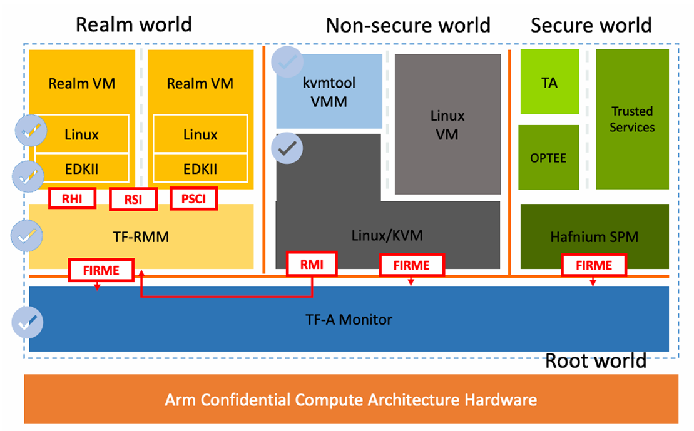

# Arm CCA reference software stack

This repository provides a pre-compiled, professional-grade **Arm Confidential Compute Architecture (CCA)** software stack based on the **Arm Fixed Virtual Platform (FVP)**. 
It is designed for developers and researchers to explore Realm Management Extension (RME), understand Realm VM lifecycles, and evaluate performance in a secure environment.

### Technical Components

The software stack follows the **Arm CCA Reference Architecture** and includes:



- **TF-A (Trusted Firmware-A):**
    - Serves as the **EL3 monitor**, performing context switching between security states.
    - Manages the **Granule Protection Table (GPT)** and performs realm attestation and device assignment.
        
- **TF-RMM (Realm Management Monitor):**
    - Fully compliant with the RMM specification; implements **RSI** (Realm Service Interface) and **RMI** (Realm Management Interface).
        
- **Linux KVM:**
    - **Type-2 Hypervisor:** Utilizes **FEAT_VHE** to run the host kernel and KVM at Non-secure EL2, reducing context switch overhead.
    - **CCA Management:** Communicates with TF-RMM via RMI to delegate pages to the Realm world, making them inaccessible to the Non-secure world.
        
- **kvmtool (VMM):**
    - A prototype VMM that creates and schedules VMs using new KVM UAPIs.
    - Provides device virtualization through emulation or direct assignment.
        
- **Realm Software:**
    - **EDKII Firmware:** Enhanced to boot the guest Linux kernel in the Realm world.
    - **Guest Linux:** Supports **RSI** to communicate with TF-RMM for managing Realm IPA state and configuration discovery.

---

## Prerequisites

Before deployment, ensure your host environment is prepared:

1. **FVP (Fixed Virtual Platform):** Download and install **FVP_Base_RevC-2xAEMvA** from the Arm Developer website.

```bash
● wget https://developer.arm.com/-/cdn-downloads/permalink/FVPs-Architecture/FM-11.30/FVP_Base_RevC-2xAEMvA_11.30_27_Linux64.tgz
```

2. **System Utilities:** Install `xterm` and `telnet` to manage multiple UART consoles.

```bash
● apt-get install xterm telnet git
```

---

## Deployment Steps

### 1. Clone the Repository

```bash
● git clone https://github.com/DaiZhiyuan/arm-cca-forge.git
● cd arm-cca-forge
● git lfs pull
```

### 2. Configure Environment

Ensure your FVP binary is accessible in your system path:

```bash
● export PATH=$PATH:"/usr/local/src/Base_RevC_AEMvA_pkg/models/Linux64_GCC-9.3/"

● FVP_Base_RevC-2xAEMvA --version
Fast Models [11.30.27 (Nov 14 2025)]
Copyright 2000-2025 ARM Limited.
All Rights Reserved.
```

### 3. Launch the Stack

Run the integrated launch script. This will initialize the FVP and automatically open multiple terminals for the different software components:

Bash

```
● ./run_cca_fvp.sh
```

---

## Experiences & Benchmarks

Once the system is booted into the Host Linux, you can perform the following:

### Launch a Realm VM

Use the pre-configured `kvmtool` to launch a protected Realm:

```bash
● cd /cca
● ./lkvm run --realm --disable-sve --irqchip=gicv3-its --firmware KVMTOOL_EFI.fd -c 1 -m 512 --no-pvtime --force-pci --disk guest-disk.img --measurement-algo=sha256 --restricted_mem
```

### Run Micro-benchmarks

Execute `kvm-unit-tests` to measure the architectural overhead of CCA transitions:

```bash
# Inside the Host Linux
● cd /cca/kvm-unit-tests/arm
● ./run-realm-tests
```

### Verify Memory Isolation

Observe how the RMM and GPT prevent the Non-secure Host from accessing memory granules assigned to the Realm world.

