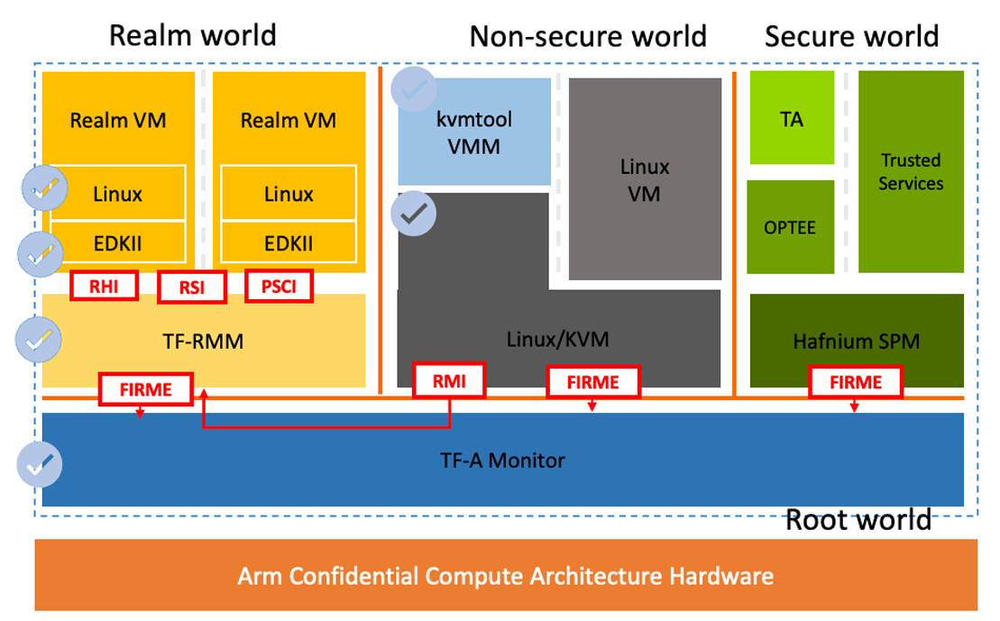

# Arm CCA reference software stack

This repository provides a pre-compiled, professional-grade **Arm Confidential Compute Architecture (CCA)** software stack based on the **Arm Fixed Virtual Platform (FVP)**. 
It is designed for developers and researchers to explore Realm Management Extension (RME), understand Realm VM lifecycles, and evaluate performance in a secure environment.

### Technical Components

The software stack follows the **Arm CCA Reference Architecture** and includes:



- **TF-A (Trusted Firmware-A):**
    - Serves as the **EL3 monitor**, performing context switching between security states.
    - Manages the **Granule Protection Table (GPT)** and performs realm attestation and device assignment.
        
- **TF-RMM (Realm Management Monitor):**
    - Fully compliant with the RMM specification; implements **RSI** (Realm Service Interface) and **RMI** (Realm Management Interface).
        
- **Linux KVM:**
    - **Type-2 Hypervisor:** Utilizes **FEAT_VHE** to run the host kernel and KVM at Non-secure EL2, reducing context switch overhead.
    - **CCA Management:** Communicates with TF-RMM via RMI to delegate pages to the Realm world, making them inaccessible to the Non-secure world.
        
- **kvmtool (VMM):**
    - A prototype VMM that creates and schedules VMs using new KVM UAPIs.
    - Provides device virtualization through emulation or direct assignment.
        
- **Realm Software:**
    - **EDKII Firmware:** Enhanced to boot the guest Linux kernel in the Realm world.
    - **Guest Linux:** Supports **RSI** to communicate with TF-RMM for managing Realm IPA state and configuration discovery.

---

## Prerequisites

Before deployment, ensure your host environment is prepared:

1. **FVP (Fixed Virtual Platform):** Download and install **FVP_Base_RevC-2xAEMvA** from the Arm Developer website.

```bash
● wget https://developer.arm.com/-/cdn-downloads/permalink/FVPs-Architecture/FM-11.30/FVP_Base_RevC-2xAEMvA_11.30_27_Linux64.tgz
```

2. **System Utilities:** Install `xterm` and `telnet` to manage multiple UART consoles.

```bash
● apt-get install xterm telnet git
```

---

## Deployment Steps

### 1. Clone the Repository

```bash
● git clone https://github.com/DaiZhiyuan/arm-cca-forge.git
● cd arm-cca-forge
● git lfs pull
```

### 2. Configure Environment

Ensure your FVP binary is accessible in your system path:

```bash
● export PATH=$PATH:"/usr/local/src/Base_RevC_AEMvA_pkg/models/Linux64_GCC-9.3/"

● FVP_Base_RevC-2xAEMvA --version
Fast Models [11.30.27 (Nov 14 2025)]
Copyright 2000-2025 ARM Limited.
All Rights Reserved.
```

### 3. Launch the Stack

Run the integrated launch script. This will initialize the FVP and automatically open multiple terminals for the different software components:

Bash

```
● ./run_cca_fvp.sh
```

---

## Experiences & Benchmarks

Once the system is booted into the Host Linux, you can perform the following:

### Launch a Realm VM

Use the pre-configured `kvmtool` to launch a protected Realm:

```bash
● cd /cca
● ./lkvm run --realm --disable-sve --irqchip=gicv3-its --firmware KVMTOOL_EFI.fd -c 1 -m 512 --no-pvtime --force-pci --disk guest-disk.img --measurement-algo=sha256 --restricted_mem
```

### Run Micro-benchmarks

Execute `kvm-unit-tests` to measure the architectural overhead of CCA transitions:

```bash
# Inside the Host Linux
● cd /cca/kvm-unit-tests/arm
● ./run-realm-tests
```

### Verify Memory Isolation

Observe how the RMM and GPT prevent the Non-secure Host from accessing memory granules assigned to the Realm world.

### The boot flow from power-on to Realme EL1 & EL0 Virtual Machine

#### Firmware Overview

The system firmware architecture consists of two primary components: **Secure Firmware(bl1.bin)** and the **Firmware Image Package (fip.bin)**.

The FIP is a container that bundles multiple bootloader stages and runtime firmware.

| **Component** | **Description**                            | **Command-line Flag** |
| ------------- | ------------------------------------------ | --------------------- |
| **BL2**       | Trusted Boot Firmware                      | `--tb-fw`             |
| **BL31**      | EL3 Runtime Firmware (SoC-specific)        | `--soc-fw`            |
| **BL32**      | Secure Payload / Trusted OS (e.g., OP-TEE) | `--tos-fw`            |
| **BL33**      | Non-Trusted Firmware (e.g., U-Boot/UEFI)   | `--nt-fw`             |
| **RMM**       | Realm Management Monitor Firmware          | `--rmm-fw`            |


**Trusted Boot Firmware BL1(EL3/root) (POWER-ON):**

```
NOTICE:  Booting Trusted Firmware
NOTICE:  BL1: v2.14.0(debug):sandbox/v2.14-1-ge71e70a05
NOTICE:  BL1: Built : 02:03:27, Jan 27 2026
INFO:    BL1: RAM 0x4051000 - 0x4058000

INFO:    BL1: Loading BL2
NOTICE:  BL1: Booting BL2
INFO:    Entry point address = 0x4032000
INFO:    SPSR = 0x3cd
INFO:    Configuring TrustZone Controller
INFO:    Total 6 regions set.
INFO:    GPT: Boot Configuration
INFO:      PPS/T:     0x2/40
INFO:      PGS/P:     0x0/12
INFO:      L0GPTSZ/S: 0x0/30
INFO:      PAS count: 7
INFO:      L0 base:   0x405e000
INFO:    Enabling Granule Protection Checks
```

**Trusted Boot Firmware BL2(EL3/root):**

```
NOTICE:  BL2: v2.14.0(debug):sandbox/v2.14-1-ge71e70a05
NOTICE:  BL2: Built : 02:03:29, Jan 27 2026
INFO:    BL2: Doing platform setup

INFO:    BL2: Loading BL31
NOTICE:  BL2: Booting BL31
INFO:    Entry point address = 0x4003000
INFO:    SPSR = 0x3cd
```
**EL3 Runtime Firmware BL31(EL3/Root):**

```
NOTICE:  BL31: v2.14.0(debug):sandbox/v2.14-1-ge71e70a05
NOTICE:  BL31: Built : 02:03:30, Jan 27 2026
INFO:    GICv3 without legacy support detected.
INFO:    ARM GICv3 driver initialized in EL3
INFO:    Maximum SPI INTID supported: 255
INFO:    Maximum ESPI INTID supported: 5119
INFO:    BL31: Initializing runtime services
INFO:    SPM Core setup done.
INFO:    RMM setup done.
INFO:    BL31: Initializing BL32

INFO:    BL31: Initializing RMM
INFO:    RMM init start.
INFO:    RMM init end.

INFO:    BL31: Preparing for EL3 exit to normal world
INFO:    Entry point address = 0x88000000
INFO:    SPSR = 0x3c9
```

**Secure Payload BL32 (Secure EL2):**

```
INFO: Initializing Hafnium (SPMC)
INFO: text: 0x6000000 - 0x602d000
INFO: rodata: 0x602d000 - 0x6036000
INFO: data: 0x6036000 - 0x611a000
INFO: stacks: 0x6120000 - 0x6130000
INFO: Supported bits in physical address: 48
INFO: Stage 2 has 5 page table levels with 1 pages at the root.
INFO: Stage 1 has 5 page table levels with 1 pages at the root.
INFO: Memory range:  0xfd000000 - 0xfeffffff
INFO: Memory range:  0x7000000 - 0x7ffffff
INFO: Memory range:  0xff000000 - 0xffffffff
INFO: Arm SMMUv3 initialized

/* VM runing at Secure EL1 */
INFO: Loading VM id 0x8001: cactus-primary.
INFO: Loading VM id 0x8002: cactus-secondary.
INFO: Loading VM id 0x8003: cactus-tertiary.
INFO: Loading VM id 0x8004: ivy.

INFO: Hafnium initialisation completed
[8001 0] NOTICE:  Booting Secure Partition (ID: 8001)
[8002 0] NOTICE:  Booting Secure Partition (ID: 8002)
[8003 0] NOTICE:  Booting Secure Partition (ID: 8003)
[8004 0] NOTICE:  Booting Secure Partition (ID: 8004)
NOTICE: Finished bootstrapping all SPs on CPU0
```

**Realm Monitor Management Firmware (Realm EL2):**
```
RMM_MEM_SCRUB_METHOD is default.
Booting RMM v.0.8.0(debug) tf-rmm-v0.8.0 Built: Jan 21 2026 07:59:20 with GCC 14.3.1
RMM-EL3 Interface v.0.8
Boot Manifest Interface v.0.5
RMI ABI revision v1.0
RSI ABI revision v1.0
```

**Non-Trusted Firmware BL33(Non-secure EL2):**
```
UEFI firmware (version  built at 06:38:15 on Jan 21 2026)

Press ESCAPE for boot options ...........UEFI Interactive Shell v2.2

EDK II
UEFI v2.70 (EDK II, 0x00010000)

Mapping table
      FS2: Alias(s):F4:
          VenHw(C5B9C74A-6D72-4719-99AB-C59F199091EB)
      FS1: Alias(s):F1:
          MemoryMapped(0xB,0x88000000,0x8827FFFF)
      FS0: Alias(s):F0:
          Fv(87940482-FC81-41C3-87E6-399CF85AC8A0)
     BLK2: Alias(s):
          VenHw(DE6AE758-D662-4E17-A97C-4C5964DA4C41,00)
     BLK3: Alias(s):
          VenHw(DE6AE758-D662-4E17-A97C-4C5964DA4C41,01)
     BLK4: Alias(s):
          VenHw(DE6AE758-D662-4E17-A97C-4C5964DA4C41,02)
     BLK5: Alias(s):
          VenHw(DE6AE758-D662-4E17-A97C-4C5964DA4C41,03)
     BLK0: Alias(s):
          VenHw(09831032-6FA3-4484-AF4F-0A000A8D3A82)
     BLK1: Alias(s):
          VenHw(405B2307-6839-4D52-AEB9-BECE64252800)

Shell> Image root=/dev/vda
```

**Linux (Non-secure EL2&EL0 with VHE mode):**

```
EFI stub: Booting Linux Kernel...
EFI stub: KASLR disabled on kernel command line
EFI stub: Using DTB from command line
EFI stub: Exiting boot services...
[    0.000000] Booting Linux on physical CPU 0x0000000000 [0x410fd0f0]
[    0.000000] Linux version 6.15.0-rc1-g916aeec68dd4 (tuxmake@shrinkwrap) (aarch64-linux-gnu-gcc (Debian 14.2.0-19) 14.2.0, GNU ld (GNU Binutils for Debian) 2.44) #1 SMP PREEMPT @1768980112
[    0.000000] KASLR disabled on command line
[    0.000000] Machine model: FVP Base RevC
[    0.000000] Memory limited to 1024MB
[    0.000000] efi: EFI v2.7 by EDK II
[    0.000000] efi: ACPI 2.0=0xfb1f4018 MEMATTR=0xfa3a1018 MEMRESERVE=0xfa371f18
[    0.000000] ACPI: Early table checksum verification disabled
[    0.000000] ACPI: RSDP 0x00000000FB1F4018 000024 (v02 ARMLTD)
[    0.000000] ACPI: XSDT 0x00000000FB1F4F18 00007C (v01 ARMLTD ARMLFACP 00010000      01000013)
[    0.000000] ACPI: FACP 0x00000000FB1F4B18 000114 (v06 ARMLTD ARMLFACP 00010000 DYNT 00010000)
[    0.000000] ACPI: DSDT 0x00000000FB1F4998 0000A3 (v02 ARMLTD ARM-VEXP 00000001 INTL 20250404)
[    0.000000] ACPI: GTDT 0x00000000FB1F4C98 0000E8 (v03 ARMLTD ARMLGTDT 00010000 ARMH 00010000)
[    0.000000] ACPI: APIC 0x00000000FB1F4098 0002F8 (v06 ARMLTD ARMLAPIC 00010000 ARMH 00010000)
[    0.000000] ACPI: SPCR 0x00000000FB1F4E18 000050 (v02 ARMLTD ARMLSPCR 00010000 DYNT 00010000)
[    0.000000] ACPI: SSDT 0x00000000FB1F4498 000094 (v02 ARMLTD SERIAL   00000001 INTL 20250404)
[    0.000000] ACPI: DBG2 0x00000000FB1F4598 00005D (v00 ARMLTD ARMLDBG2 00010000 DYNT 00010000)
[    0.000000] ACPI: SSDT 0x00000000FB1F4698 000094 (v02 ARMLTD SERIAL   00000001 INTL 20250404)
[    0.000000] ACPI: SSDT 0x00000000FB1F4798 000112 (v02 ARMLTD ARMLSSDT 00010000 DYNT 00010000)
[    0.000000] ACPI: IORT 0x00000000FB1CF018 0000DC (v00 ARMLTD ARMLIORT 00010000 ARMH 00010000)
[    0.000000] ACPI: MCFG 0x00000000FB1F4918 00003C (v01 ARMLTD ARMLMCFG 00010000 DYNT 00010000)
[    0.000000] ACPI: SSDT 0x00000000FB1CFC18 000306 (v02 ARMLTD FVP-REVC 00000001 INTL 20250404)
[    0.000000] ACPI: SPCR: console: pl011,mmio32,0x1c090000,115200
[    0.000000] earlycon: pl11 at MMIO32 0x000000001c090000 (options '115200')
[    0.000000] printk: legacy bootconsole [pl11] enabled
[    0.000000] ACPI: Use ACPI SPCR as default console: Yes
[    0.000000] NUMA: Faking a node at [mem 0x0000000080000000-0x00000000fb75ffff]
[    0.000000] NODE_DATA(0) allocated [mem 0xbfe03880-0xbfe05fff]
[    0.000000] Zone ranges:
[    0.000000]   DMA      [mem 0x0000000080000000-0x00000000fb75ffff]
[    0.000000]   DMA32    empty
[    0.000000]   Normal   empty
[    0.000000] Movable zone start for each node
[    0.000000] Early memory node ranges
[    0.000000]   node   0: [mem 0x0000000080000000-0x00000000bfffffff]
[    0.000000]   node   0: [mem 0x00000000f2c00000-0x00000000f52dffff]
[    0.000000]   node   0: [mem 0x00000000fa160000-0x00000000fa1cffff]
[    0.000000]   node   0: [mem 0x00000000fac30000-0x00000000fac6ffff]
[    0.000000]   node   0: [mem 0x00000000facc0000-0x00000000fad3ffff]
[    0.000000]   node   0: [mem 0x00000000fada0000-0x00000000fae3ffff]
[    0.000000]   node   0: [mem 0x00000000fae50000-0x00000000fafcffff]
[    0.000000]   node   0: [mem 0x00000000fb060000-0x00000000fb19ffff]
[    0.000000]   node   0: [mem 0x00000000fb6c0000-0x00000000fb6fffff]
[    0.000000]   node   0: [mem 0x00000000fb710000-0x00000000fb75ffff]
[    0.000000] Initmem setup node 0 [mem 0x0000000080000000-0x00000000fb75ffff]
[    0.000000] On node 0, zone DMA: 11264 pages in unavailable ranges
[    0.000000] On node 0, zone DMA: 20096 pages in unavailable ranges
[    0.000000] On node 0, zone DMA: 2656 pages in unavailable ranges
[    0.000000] On node 0, zone DMA: 80 pages in unavailable ranges
[    0.000000] On node 0, zone DMA: 96 pages in unavailable ranges
[    0.000000] On node 0, zone DMA: 16 pages in unavailable ranges
[    0.000000] On node 0, zone DMA: 144 pages in unavailable ranges
[    0.000000] On node 0, zone DMA: 1312 pages in unavailable ranges
[    0.000000] On node 0, zone DMA: 16 pages in unavailable ranges
[    0.000000] On node 0, zone DMA: 18592 pages in unavailable ranges
[    0.000000] cma: Reserved 32 MiB at 0x0000000000000000
[    0.000000] psci: probing for conduit method from ACPI.
[    0.000000] psci: PSCIv1.1 detected in firmware.
[    0.000000] psci: Using standard PSCI v0.2 function IDs
[    0.000000] psci: SMC Calling Convention v1.5
[    0.000000] percpu: Embedded 24 pages/cpu s60952 r8192 d29160 u98304
[    0.000000] Detected PIPT I-cache on CPU0
[    0.000000] CPU features: detected: Address authentication (IMP DEF algorithm)
[    0.000000] CPU features: detected: GIC system register CPU interface
[    0.000000] CPU features: detected: HCRX_EL2 register
[    0.000000] CPU features: detected: Virtualization Host Extensions
[    0.000000] CPU features: detected: Memory Tagging Extension
[    0.000000] CPU features: detected: Spectre-BHB
[    0.000000] alternatives: applying boot alternatives
[    0.000000] random: crng init done
[    0.000000] printk: log buffer data + meta data: 131072 + 458752 = 589824 bytes
[    0.000000] Dentry cache hash table entries: 131072 (order: 8, 1048576 bytes, linear)
[    0.000000] Inode-cache hash table entries: 65536 (order: 7, 524288 bytes, linear)
[    0.000000] software IO TLB: SWIOTLB bounce buffer size adjusted to 1MB
[    0.000000] software IO TLB: area num 8.
[    0.000000] software IO TLB: SWIOTLB bounce buffer size roundup to 2MB
[    0.000000] software IO TLB: mapped [mem 0x00000000bc580000-0x00000000bc780000] (2MB)
[    0.000000] Fallback order for Node 0: 0
[    0.000000] Built 1 zonelists, mobility grouping on.  Total pages: 273408
[    0.000000] Policy zone: DMA
[    0.000000] mem auto-init: stack:all(zero), heap alloc:off, heap free:off
[    0.000000] SLUB: HWalign=64, Order=0-3, MinObjects=0, CPUs=8, Nodes=1
[    0.000000] rcu: Preemptible hierarchical RCU implementation.
[    0.000000] rcu:     RCU event tracing is enabled.
[    0.000000] rcu:     RCU restricting CPUs from NR_CPUS=512 to nr_cpu_ids=8.
[    0.000000]  Trampoline variant of Tasks RCU enabled.
[    0.000000]  Tracing variant of Tasks RCU enabled.
[    0.000000] rcu: RCU calculated value of scheduler-enlistment delay is 10 jiffies.
[    0.000000] rcu: Adjusting geometry for rcu_fanout_leaf=16, nr_cpu_ids=8
[    0.000000] RCU Tasks: Setting shift to 3 and lim to 1 rcu_task_cb_adjust=1 rcu_task_cpu_ids=8.
[    0.000000] RCU Tasks Trace: Setting shift to 3 and lim to 1 rcu_task_cb_adjust=1 rcu_task_cpu_ids=8.
[    0.000000] NR_IRQS: 64, nr_irqs: 64, preallocated irqs: 0
[    0.000000] GICv3: GIC: Using split EOI/Deactivate mode
[    0.000000] GIC: enabling workaround for GICv3: HIP07 erratum 161010803
[    0.000000] GICv3: 224 SPIs implemented
[    0.000000] GICv3: 0 Extended SPIs implemented
[    0.000000] Root IRQ handler: gic_handle_irq
[    0.000000] GICv3: GICv3 features: 80 PPIs
[    0.000000] GICv3: GICD_CTRL.DS=0, SCR_EL3.FIQ=1
[    0.000000] GICv3: CPU0: found redistributor 0 region 0:0x000000002f100000
[    0.000000] ITS [mem 0x2f020000-0x2f03ffff]
[    0.000000] ITS@0x000000002f020000: allocated 8192 Devices @80070000 (indirect, esz 8, psz 64K, shr 1)
[    0.000000] ITS@0x000000002f020000: allocated 8192 Virtual CPUs @80080000 (indirect, esz 8, psz 64K, shr 1)
[    0.000000] ITS@0x000000002f020000: allocated 8192 Interrupt Collections @80090000 (flat, esz 8, psz 64K, shr 1)
[    0.000000] GICv3: using LPI property table @0x00000000800a0000
[    0.000000] GICv3: CPU0: using allocated LPI pending table @0x00000000800b0000
[    0.000000] rcu: srcu_init: Setting srcu_struct sizes based on contention.
[    0.000000] ACPI GTDT: found 1 memory-mapped timer block(s).
[    0.000000] arch_timer: cp15 and mmio timer(s) running at 100.00MHz (phys/phys).
[    0.000000] clocksource: arch_sys_counter: mask: 0x1ffffffffffffff max_cycles: 0x171024e7e0, max_idle_ns: 440795205315 ns
[    0.000003] sched_clock: 57 bits at 100MHz, resolution 10ns, wraps every 4398046511100ns
[    0.001263] Console: colour dummy device 80x25
[    0.001701] ACPI: Core revision 20240827
[    0.002452] Calibrating delay loop (skipped), value calculated using timer frequency.. 200.00 BogoMIPS (lpj=1000000)
[    0.002594] pid_max: default: 32768 minimum: 301
[    0.003088] LSM: initializing lsm=capability
[    0.003761] Mount-cache hash table entries: 2048 (order: 2, 16384 bytes, linear)
[    0.003882] Mountpoint-cache hash table entries: 2048 (order: 2, 16384 bytes, linear)
[    0.007740] ACPI PPTT: No PPTT table found, CPU and cache topology may be inaccurate
[    0.007875] cacheinfo: Unable to detect cache hierarchy for CPU 0
[    0.069970] rcu: Hierarchical SRCU implementation.
[    0.070038] rcu:     Max phase no-delay instances is 1000.
[    0.080209] Timer migration: 1 hierarchy levels; 8 children per group; 1 crossnode level
[    0.090234] fsl-mc MSI: ITS@0x2f020000 domain created
[    0.090436] Remapping and enabling EFI services.
[    0.100008] smp: Bringing up secondary CPUs ...
[    0.132444] Detected PIPT I-cache on CPU1
[    0.132637] GICv3: CPU1: found redistributor 100 region 0:0x000000002f120000
[    0.132700] GICv3: CPU1: using allocated LPI pending table @0x00000000800c0000
[    0.132809] CPU1: Booted secondary processor 0x0000000100 [0x410fd0f0]
[    0.172582] Detected PIPT I-cache on CPU2
[    0.172779] GICv3: CPU2: found redistributor 200 region 0:0x000000002f140000
[    0.172842] GICv3: CPU2: using allocated LPI pending table @0x00000000800d0000
[    0.172953] CPU2: Booted secondary processor 0x0000000200 [0x410fd0f0]
[    0.202726] Detected PIPT I-cache on CPU3
[    0.202925] GICv3: CPU3: found redistributor 300 region 0:0x000000002f160000
[    0.202990] GICv3: CPU3: using allocated LPI pending table @0x00000000800e0000
[    0.203103] CPU3: Booted secondary processor 0x0000000300 [0x410fd0f0]
[    0.222811] Detected PIPT I-cache on CPU4
[    0.223017] GICv3: CPU4: found redistributor 10000 region 0:0x000000002f180000
[    0.223081] GICv3: CPU4: using allocated LPI pending table @0x00000000800f0000
[    0.223193] CPU4: Booted secondary processor 0x0000010000 [0x410fd0f0]
[    0.242525] Detected PIPT I-cache on CPU5
[    0.242734] GICv3: CPU5: found redistributor 10100 region 0:0x000000002f1a0000
[    0.242799] GICv3: CPU5: using allocated LPI pending table @0x0000000080100000
[    0.242907] CPU5: Booted secondary processor 0x0000010100 [0x410fd0f0]
[    0.272592] Detected PIPT I-cache on CPU6
[    0.272805] GICv3: CPU6: found redistributor 10200 region 0:0x000000002f1c0000
[    0.272871] GICv3: CPU6: using allocated LPI pending table @0x0000000080110000
[    0.272981] CPU6: Booted secondary processor 0x0000010200 [0x410fd0f0]
[    0.302771] Detected PIPT I-cache on CPU7
[    0.302988] GICv3: CPU7: found redistributor 10300 region 0:0x000000002f1e0000
[    0.303054] GICv3: CPU7: using allocated LPI pending table @0x0000000080120000
[    0.303166] CPU7: Booted secondary processor 0x0000010300 [0x410fd0f0]
[    0.303919] smp: Brought up 1 node, 8 CPUs
[    0.305238] SMP: Total of 8 processors activated.
[    0.305312] CPU: All CPU(s) started at EL2
[    0.305379] CPU features: detected: Branch Target Identification
[    0.305461] CPU features: detected: 32-bit EL0 Support
[    0.305534] CPU features: detected: ARMv8.4 Translation Table Level
[    0.305618] CPU features: detected: Data cache clean to the PoU not required for I/D coherence
[    0.305717] CPU features: detected: Common not Private translations
[    0.305802] CPU features: detected: CRC32 instructions
[    0.305880] CPU features: detected: Data independent timing control (DIT)
[    0.305962] CPU features: detected: E0PD
[    0.306038] CPU features: detected: Enhanced Counter Virtualization
[    0.306123] CPU features: detected: Enhanced Counter Virtualization (CNTPOFF)
[    0.306213] CPU features: detected: Enhanced Privileged Access Never
[    0.306298] CPU features: detected: Enhanced Virtualization Traps
[    0.306384] CPU features: detected: Fine Grained Traps
[    0.306474] CPU features: detected: Generic authentication (IMP DEF algorithm)
[    0.306566] CPU features: detected: RCpc load-acquire (LDAPR)
[    0.306649] CPU features: detected: LSE atomic instructions
[    0.306731] CPU features: detected: Privileged Access Never
[    0.306811] CPU features: detected: PMUv3
[    0.306881] CPU features: detected: RAS Extension Support
[    0.306961] CPU features: detected: Random Number Generator
[    0.307041] CPU features: detected: Speculation barrier (SB)
[    0.307122] CPU features: detected: Stage-2 Force Write-Back
[    0.307201] CPU features: detected: TLB range maintenance instructions
[    0.307288] CPU features: detected: WFx with timeout
[    0.307377] CPU features: detected: Scalable Vector Extension
[    0.307820] alternatives: applying system-wide alternatives
[    0.323558] CPU features: detected: Activity Monitors Unit (AMU) on CPU0-7
[    0.323658] CPU features: detected: Hardware dirty bit management on CPU0-7
[    0.323763] SVE: maximum available vector length 64 bytes per vector
[    0.323850] SVE: default vector length 64 bytes per vector
[    0.326778] Memory: 982192K/1093632K available (17984K kernel code, 5226K rwdata, 12364K rodata, 3200K init, 742K bss, 72032K reserved, 32768K cma-reserved)
[    0.328831] devtmpfs: initialized
[    0.341736] clocksource: jiffies: mask: 0xffffffff max_cycles: 0xffffffff, max_idle_ns: 19112604462750000 ns
[    0.341884] posixtimers hash table entries: 4096 (order: 4, 65536 bytes, linear)
[    0.342221] futex hash table entries: 2048 (order: 5, 131072 bytes, linear)
[    0.345959] 22816 pages in range for non-PLT usage
[    0.345990] 514336 pages in range for PLT usage
[    0.346685] pinctrl core: initialized pinctrl subsystem
[    0.354731] DMI not present or invalid.
[    0.381481] NET: Registered PF_NETLINK/PF_ROUTE protocol family
[    0.391522] DMA: preallocated 128 KiB GFP_KERNEL pool for atomic allocations
[    0.397982] DMA: preallocated 128 KiB GFP_KERNEL|GFP_DMA pool for atomic allocations
[    0.407360] DMA: preallocated 128 KiB GFP_KERNEL|GFP_DMA32 pool for atomic allocations
[    0.407569] audit: initializing netlink subsys (disabled)
[    0.408710] audit: type=2000 audit(0.390:1): state=initialized audit_enabled=0 res=1
[    0.413590] thermal_sys: Registered thermal governor 'step_wise'
[    0.413625] thermal_sys: Registered thermal governor 'power_allocator'
[    0.414011] cpuidle: using governor menu
[    0.415597] hw-breakpoint: found 16 breakpoint and 16 watchpoint registers.
[    0.416429] ASID allocator initialised with 65536 entries
[    0.429303] acpiphp: ACPI Hot Plug PCI Controller Driver version: 0.5
[    0.431926] Serial: AMBA PL011 UART driver
[    0.437493] HugeTLB: allocation took 0ms with hugepage_allocation_threads=2
[    0.437585] HugeTLB: allocation took 0ms with hugepage_allocation_threads=2
[    0.437694] HugeTLB: registered 1.00 GiB page size, pre-allocated 0 pages
[    0.437782] HugeTLB: 0 KiB vmemmap can be freed for a 1.00 GiB page
[    0.437876] HugeTLB: registered 32.0 MiB page size, pre-allocated 0 pages
[    0.438014] HugeTLB: 0 KiB vmemmap can be freed for a 32.0 MiB page
[    0.438116] HugeTLB: registered 2.00 MiB page size, pre-allocated 0 pages
[    0.438205] HugeTLB: 0 KiB vmemmap can be freed for a 2.00 MiB page
[    0.438307] HugeTLB: registered 64.0 KiB page size, pre-allocated 0 pages
[    0.438395] HugeTLB: 0 KiB vmemmap can be freed for a 64.0 KiB page
[    0.449795] ACPI: Added _OSI(Module Device)
[    0.449874] ACPI: Added _OSI(Processor Device)
[    0.449954] ACPI: Added _OSI(3.0 _SCP Extensions)
[    0.450037] ACPI: Added _OSI(Processor Aggregator Device)
[    0.455448] ACPI: 5 ACPI AML tables successfully acquired and loaded
[    0.458002] ACPI: Interpreter enabled
[    0.458105] ACPI: Using GIC for interrupt routing
[    0.458361] ACPI: MCFG table detected, 1 entries
[    0.492662] ARMHB000:00: ttyAMA0 at MMIO 0x1c090000 (irq = 20, base_baud = 0) is a SBSA
[    0.492822] printk: console [ttyAMA0] enabled
[    0.492822] printk: console [ttyAMA0] enabled
[    0.492959] printk: legacy bootconsole [pl11] disabled
[    0.492959] printk: legacy bootconsole [pl11] disabled
[    0.500775] ARMHB000:01: ttyAMA1 at MMIO 0x1c0b0000 (irq = 21, base_baud = 0) is a SBSA
[    0.505082] ACPI: CPU0 has been hot-added
[    0.505977] ACPI: CPU1 has been hot-added
[    0.506856] ACPI: CPU2 has been hot-added
[    0.507752] ACPI: CPU3 has been hot-added
[    0.508646] ACPI: CPU4 has been hot-added
[    0.509527] ACPI: CPU5 has been hot-added
[    0.510434] ACPI: CPU6 has been hot-added
[    0.511319] ACPI: CPU7 has been hot-added
[    0.511690] ACPI: PCI: Interrupt link LNKA configured for IRQ 168
[    0.512095] ACPI: PCI: Interrupt link LNKB configured for IRQ 169
[    0.512500] ACPI: PCI: Interrupt link LNKC configured for IRQ 170
[    0.512905] ACPI: PCI: Interrupt link LNKD configured for IRQ 171
[    0.513530] ACPI: PCI Root Bridge [PCI0] (domain 0000 [bus 00-ff])
[    0.513656] acpi PNP0A08:00: _OSC: OS supports [ExtendedConfig ASPM ClockPM Segments MSI HPX-Type3]
[    0.515276] acpi PNP0A08:00: _OSC: platform does not support [LTR]
[    0.518152] acpi PNP0A08:00: _OSC: OS now controls [PME AER PCIeCapability]
[    0.520506] acpi PNP0A08:00: [Firmware Bug]: ECAM area [mem 0x40000000-0x4fffffff] not reserved in ACPI namespace
[    0.520682] acpi PNP0A08:00: ECAM at [mem 0x40000000-0x4fffffff] for [bus 00-ff]
[    0.521106] ACPI: Remapped I/O 0x000000005f800000 to [io  0x0000-0x7fffff window]
[    0.521983] PCI host bridge to bus 0000:00
[    0.522080] pci_bus 0000:00: root bus resource [mem 0x50000000-0x57ffffff window]
[    0.522154] pci_bus 0000:00: root bus resource [mem 0x4000000000-0x40ffffffff window]
[    0.522231] pci_bus 0000:00: root bus resource [io  0x0000-0x7fffff window]
[    0.522303] pci_bus 0000:00: root bus resource [bus 00-ff]
[    0.522447] pci 0000:00:00.0: [13b5:00ba] type 00 class 0x060001 PCIe Root Complex Integrated Endpoint
[    0.522580] pci 0000:00:00.0: BAR 0 [mem 0x5080e000-0x5080efff]
[    0.522677] pci 0000:00:00.0: enabling Extended Tags
[    0.522862] pci 0000:00:00.0: PME# supported from D3hot
[    0.524056] pci 0000:00:01.0: [13b5:0def] type 01 class 0x060400 PCIe Root Port
[    0.524186] pci 0000:00:01.0: BAR 0 [mem 0x5080d000-0x5080dfff]
[    0.524262] pci 0000:00:01.0: PCI bridge to [bus 01]
[    0.524330] pci 0000:00:01.0:   bridge window [mem 0x50700000-0x507fffff]
[    0.524422] pci 0000:00:01.0: enabling Extended Tags
[    0.524611] pci 0000:00:01.0: PME# supported from D3hot
[    0.525817] pci 0000:00:02.0: [13b5:0def] type 01 class 0x060400 PCIe Root Port
[    0.525947] pci 0000:00:02.0: BAR 0 [mem 0x50808000-0x50808fff pref]
[    0.526026] pci 0000:00:02.0: PCI bridge to [bus 02]
[    0.526094] pci 0000:00:02.0:   bridge window [mem 0x50600000-0x506fffff]
[    0.526184] pci 0000:00:02.0: enabling Extended Tags
[    0.526374] pci 0000:00:02.0: PME# supported from D3hot
[    0.527581] pci 0000:00:03.0: [13b5:0def] type 01 class 0x060400 PCIe Root Port
[    0.527709] pci 0000:00:03.0: BAR 0 [mem 0x50809000-0x50809fff pref]
[    0.527789] pci 0000:00:03.0: PCI bridge to [bus 03-07]
[    0.527860] pci 0000:00:03.0:   bridge window [mem 0x50300000-0x505fffff]
[    0.527940] pci 0000:00:03.0:   bridge window [mem 0x50000000-0x501fffff 64bit pref]
[    0.528024] pci 0000:00:03.0: enabling Extended Tags
[    0.528212] pci 0000:00:03.0: PME# supported from D3hot
[    0.529405] pci 0000:00:04.0: [13b5:0def] type 01 class 0x060400 PCIe Root Port
[    0.529535] pci 0000:00:04.0: BAR 0 [mem 0x5080a000-0x5080afff pref]
[    0.529603] pci 0000:00:04.0: PCI bridge to [bus 08]
[    0.529682] pci 0000:00:04.0:   bridge window [mem 0x50200000-0x502fffff]
[    0.529773] pci 0000:00:04.0: enabling Extended Tags
[    0.529962] pci 0000:00:04.0: PME# supported from D3hot
[    0.531301] pci 0000:00:1e.0: [13b5:ff80] type 00 class 0xff0000 PCIe Root Complex Integrated Endpoint
[    0.531457] pci 0000:00:1e.0: BAR 0 [mem 0x4000040000-0x400007ffff 64bit]
[    0.531536] pci 0000:00:1e.0: BAR 2 [mem 0x4000088000-0x400008ffff 64bit]
[    0.531616] pci 0000:00:1e.0: BAR 4 [mem 0x4000091000-0x4000091fff 64bit]
[    0.531703] pci 0000:00:1e.0: enabling Extended Tags
[    0.531906] pci 0000:00:1e.0: PME# supported from D3hot
[    0.533074] pci 0000:00:1e.1: [13b5:ff80] type 00 class 0xff0000 PCIe Root Complex Integrated Endpoint
[    0.533230] pci 0000:00:1e.1: BAR 0 [mem 0x4000000000-0x400003ffff 64bit]
[    0.533309] pci 0000:00:1e.1: BAR 2 [mem 0x4000080000-0x4000087fff 64bit]
[    0.533389] pci 0000:00:1e.1: BAR 4 [mem 0x4000090000-0x4000090fff 64bit]
[    0.533477] pci 0000:00:1e.1: enabling Extended Tags
[    0.533678] pci 0000:00:1e.1: PME# supported from D3hot
[    0.534902] pci 0000:00:1f.0: [0abc:aced] type 00 class 0x010601 PCIe Root Complex Integrated Endpoint
[    0.535060] pci 0000:00:1f.0: BAR 0 [mem 0x50806000-0x50807fff]
[    0.535133] pci 0000:00:1f.0: BAR 1 [mem 0x50804000-0x50805fff]
[    0.535206] pci 0000:00:1f.0: BAR 2 [mem 0x5080c000-0x5080cfff]
[    0.535279] pci 0000:00:1f.0: BAR 3 [mem 0x50802000-0x50803fff]
[    0.535351] pci 0000:00:1f.0: BAR 4 [mem 0x5080b000-0x5080bfff]
[    0.535424] pci 0000:00:1f.0: BAR 5 [mem 0x50800000-0x50801fff]
[    0.535507] pci 0000:00:1f.0: enabling Extended Tags
[    0.535700] pci 0000:00:1f.0: PME# supported from D3hot
[    0.537240] pci 0000:01:00.0: [0abc:aced] type 00 class 0x010601 PCIe Endpoint
[    0.537393] pci 0000:01:00.0: BAR 0 [mem 0x50706000-0x50707fff]
[    0.537466] pci 0000:01:00.0: BAR 1 [mem 0x50704000-0x50705fff]
[    0.537539] pci 0000:01:00.0: BAR 2 [mem 0x50709000-0x50709fff]
[    0.537612] pci 0000:01:00.0: BAR 3 [mem 0x50702000-0x50703fff]
[    0.537685] pci 0000:01:00.0: BAR 4 [mem 0x50708000-0x50708fff]
[    0.537758] pci 0000:01:00.0: BAR 5 [mem 0x50700000-0x50701fff]
[    0.537842] pci 0000:01:00.0: enabling Extended Tags
[    0.538034] pci 0000:01:00.0: PME# supported from D3hot
[    0.539629] pci 0000:02:00.0: [13b5:ff80] type 00 class 0xff0000 PCIe Endpoint
[    0.539779] pci 0000:02:00.0: BAR 0 [mem 0x50600000-0x5063ffff 64bit]
[    0.539857] pci 0000:02:00.0: BAR 2 [mem 0x50680000-0x50687fff 64bit]
[    0.539934] pci 0000:02:00.0: BAR 4 [mem 0x50690000-0x50690fff 64bit]
[    0.540020] pci 0000:02:00.0: enabling Extended Tags
[    0.540223] pci 0000:02:00.0: PME# supported from D3hot
[    0.541422] pci 0000:02:00.4: [13b5:ff80] type 00 class 0xff0000 PCIe Endpoint
[    0.541573] pci 0000:02:00.4: BAR 0 [mem 0x50640000-0x5067ffff 64bit]
[    0.541650] pci 0000:02:00.4: BAR 2 [mem 0x50688000-0x5068ffff 64bit]
[    0.541727] pci 0000:02:00.4: BAR 4 [mem 0x50691000-0x50691fff 64bit]
[    0.541813] pci 0000:02:00.4: enabling Extended Tags
[    0.542016] pci 0000:02:00.4: PME# supported from D3hot
[    0.543652] pci 0000:03:00.0: [13b5:0def] type 01 class 0x060400 PCIe Switch Upstream Port
[    0.543784] pci 0000:03:00.0: BAR 0 [mem 0x50100000-0x50100fff pref]
[    0.543863] pci 0000:03:00.0: PCI bridge to [bus 04-07]
[    0.543933] pci 0000:03:00.0:   bridge window [mem 0x50300000-0x505fffff]
[    0.544100] pci 0000:03:00.0:   bridge window [mem 0x50000000-0x500fffff 64bit pref]
[    0.544187] pci 0000:03:00.0: enabling Extended Tags
[    0.544376] pci 0000:03:00.0: PME# supported from D3hot
[    0.546052] pci 0000:04:00.0: [13b5:0def] type 01 class 0x060400 PCIe Switch Downstream Port
[    0.546185] pci 0000:04:00.0: BAR 0 [mem 0x50002000-0x50002fff pref]
[    0.546264] pci 0000:04:00.0: PCI bridge to [bus 05]
[    0.546332] pci 0000:04:00.0:   bridge window [mem 0x50500000-0x505fffff]
[    0.546427] pci 0000:04:00.0: enabling Extended Tags
[    0.546615] pci 0000:04:00.0: PME# supported from D3hot
[    0.547835] pci 0000:04:01.0: [13b5:0def] type 01 class 0x060400 PCIe Switch Downstream Port
[    0.547967] pci 0000:04:01.0: BAR 0 [mem 0x50001000-0x50001fff pref]
[    0.548046] pci 0000:04:01.0: PCI bridge to [bus 06]
[    0.548107] pci 0000:04:01.0:   bridge window [mem 0x50400000-0x504fffff]
[    0.548210] pci 0000:04:01.0: enabling Extended Tags
[    0.548399] pci 0000:04:01.0: PME# supported from D3hot
[    0.549615] pci 0000:04:02.0: [13b5:0def] type 01 class 0x060400 PCIe Switch Downstream Port
[    0.549748] pci 0000:04:02.0: BAR 0 [mem 0x50000000-0x50000fff pref]
[    0.549827] pci 0000:04:02.0: PCI bridge to [bus 07]
[    0.549895] pci 0000:04:02.0:   bridge window [mem 0x50300000-0x503fffff]
[    0.549991] pci 0000:04:02.0: enabling Extended Tags
[    0.550180] pci 0000:04:02.0: PME# supported from D3hot
[    0.551934] pci 0000:05:00.0: [0abc:aced] type 00 class 0x010601 PCIe Endpoint
[    0.552085] pci 0000:05:00.0: BAR 0 [mem 0x50506000-0x50507fff]
[    0.552160] pci 0000:05:00.0: BAR 1 [mem 0x50504000-0x50505fff]
[    0.552234] pci 0000:05:00.0: BAR 2 [mem 0x50509000-0x50509fff]
[    0.552307] pci 0000:05:00.0: BAR 3 [mem 0x50502000-0x50503fff]
[    0.552380] pci 0000:05:00.0: BAR 4 [mem 0x50508000-0x50508fff]
[    0.552453] pci 0000:05:00.0: BAR 5 [mem 0x50500000-0x50501fff]
[    0.552536] pci 0000:05:00.0: enabling Extended Tags
[    0.552729] pci 0000:05:00.0: PME# supported from D3hot
[    0.554382] pci 0000:06:00.0: [13b5:ff80] type 00 class 0xff0000 PCIe Endpoint
[    0.554534] pci 0000:06:00.0: BAR 0 [mem 0x50400000-0x5043ffff 64bit]
[    0.554612] pci 0000:06:00.0: BAR 2 [mem 0x50480000-0x50487fff 64bit]
[    0.554689] pci 0000:06:00.0: BAR 4 [mem 0x50490000-0x50490fff 64bit]
[    0.554775] pci 0000:06:00.0: enabling Extended Tags
[    0.554977] pci 0000:06:00.0: PME# supported from D3hot
[    0.556186] pci 0000:06:00.7: [13b5:ff80] type 00 class 0xff0000 PCIe Endpoint
[    0.556335] pci 0000:06:00.7: BAR 0 [mem 0x50440000-0x5047ffff 64bit]
[    0.556401] pci 0000:06:00.7: BAR 2 [mem 0x50488000-0x5048ffff 64bit]
[    0.556491] pci 0000:06:00.7: BAR 4 [mem 0x50491000-0x50491fff 64bit]
[    0.556576] pci 0000:06:00.7: enabling Extended Tags
[    0.556781] pci 0000:06:00.7: PME# supported from D3hot
[    0.558430] pci 0000:07:00.0: [13b5:ff80] type 00 class 0xff0000 PCIe Endpoint
[    0.558581] pci 0000:07:00.0: BAR 0 [mem 0x50300000-0x5033ffff 64bit]
[    0.558658] pci 0000:07:00.0: BAR 2 [mem 0x50380000-0x50387fff 64bit]
[    0.558735] pci 0000:07:00.0: BAR 4 [mem 0x50390000-0x50390fff 64bit]
[    0.558821] pci 0000:07:00.0: enabling Extended Tags
[    0.559025] pci 0000:07:00.0: PME# supported from D3hot
[    0.560213] pci 0000:07:00.3: [13b5:ff80] type 00 class 0xff0000 PCIe Endpoint
[    0.560364] pci 0000:07:00.3: BAR 0 [mem 0x50340000-0x5037ffff 64bit]
[    0.560442] pci 0000:07:00.3: BAR 2 [mem 0x50388000-0x5038ffff 64bit]
[    0.560519] pci 0000:07:00.3: BAR 4 [mem 0x50391000-0x50391fff 64bit]
[    0.560605] pci 0000:07:00.3: enabling Extended Tags
[    0.560807] pci 0000:07:00.3: PME# supported from D3hot
[    0.562530] pci 0000:08:00.0: [13b5:ff80] type 00 class 0xff0000 PCIe Endpoint
[    0.562681] pci 0000:08:00.0: BAR 0 [mem 0x50200000-0x5023ffff 64bit]
[    0.562759] pci 0000:08:00.0: BAR 2 [mem 0x50280000-0x50287fff 64bit]
[    0.562836] pci 0000:08:00.0: BAR 4 [mem 0x50290000-0x50290fff 64bit]
[    0.562922] pci 0000:08:00.0: enabling Extended Tags
[    0.563125] pci 0000:08:00.0: PME# supported from D3hot
[    0.564330] pci 0000:08:00.1: [13b5:ff80] type 00 class 0xff0000 PCIe Endpoint
[    0.564481] pci 0000:08:00.1: BAR 0 [mem 0x50240000-0x5027ffff 64bit]
[    0.564558] pci 0000:08:00.1: BAR 2 [mem 0x50288000-0x5028ffff 64bit]
[    0.564635] pci 0000:08:00.1: BAR 4 [mem 0x50291000-0x50291fff 64bit]
[    0.564722] pci 0000:08:00.1: enabling Extended Tags
[    0.564924] pci 0000:08:00.1: PME# supported from D3hot
[    0.566559] pci 0000:00:01.0: bridge window [mem 0x50000000-0x500fffff]: assigned
[    0.566655] pci 0000:00:02.0: bridge window [mem 0x50100000-0x501fffff]: assigned
[    0.566733] pci 0000:00:03.0: bridge window [mem 0x50200000-0x506fffff]: assigned
[    0.566812] pci 0000:00:04.0: bridge window [mem 0x50700000-0x507fffff]: assigned
[    0.566896] pci 0000:00:1e.0: BAR 0 [mem 0x4000000000-0x400003ffff 64bit]: assigned
[    0.566994] pci 0000:00:1e.1: BAR 0 [mem 0x4000040000-0x400007ffff 64bit]: assigned
[    0.567090] pci 0000:00:1e.0: BAR 2 [mem 0x4000080000-0x4000087fff 64bit]: assigned
[    0.567191] pci 0000:00:1e.1: BAR 2 [mem 0x4000088000-0x400008ffff 64bit]: assigned
[    0.567282] pci 0000:00:1f.0: BAR 0 [mem 0x50800000-0x50801fff]: assigned
[    0.567365] pci 0000:00:1f.0: BAR 1 [mem 0x50802000-0x50803fff]: assigned
[    0.567447] pci 0000:00:1f.0: BAR 3 [mem 0x50804000-0x50805fff]: assigned
[    0.567529] pci 0000:00:1f.0: BAR 5 [mem 0x50806000-0x50807fff]: assigned
[    0.567611] pci 0000:00:01.0: BAR 0 [mem 0x50808000-0x50808fff]: assigned
[    0.567695] pci 0000:00:02.0: BAR 0 [mem 0x50809000-0x50809fff pref]: assigned
[    0.567782] pci 0000:00:03.0: BAR 0 [mem 0x5080a000-0x5080afff pref]: assigned
[    0.567871] pci 0000:00:04.0: BAR 0 [mem 0x5080b000-0x5080bfff pref]: assigned
[    0.567961] pci 0000:00:1e.0: BAR 4 [mem 0x4000090000-0x4000090fff 64bit]: assigned
[    0.568060] pci 0000:00:1e.1: BAR 4 [mem 0x4000091000-0x4000091fff 64bit]: assigned
[    0.568155] pci 0000:00:1f.0: BAR 2 [mem 0x5080c000-0x5080cfff]: assigned
[    0.568239] pci 0000:00:1f.0: BAR 4 [mem 0x5080d000-0x5080dfff]: assigned
[    0.568376] pci 0000:01:00.0: BAR 0 [mem 0x50000000-0x50001fff]: assigned
[    0.568456] pci 0000:01:00.0: BAR 1 [mem 0x50002000-0x50003fff]: assigned
[    0.568537] pci 0000:01:00.0: BAR 3 [mem 0x50004000-0x50005fff]: assigned
[    0.568617] pci 0000:01:00.0: BAR 5 [mem 0x50006000-0x50007fff]: assigned
[    0.568699] pci 0000:01:00.0: BAR 2 [mem 0x50008000-0x50008fff]: assigned
[    0.568781] pci 0000:01:00.0: BAR 4 [mem 0x50009000-0x50009fff]: assigned
[    0.568865] pci 0000:00:01.0: PCI bridge to [bus 01]
[    0.568926] pci 0000:00:01.0:   bridge window [mem 0x50000000-0x500fffff]
[    0.569045] pci 0000:02:00.0: BAR 0 [mem 0x50100000-0x5013ffff 64bit]: assigned
[    0.569140] pci 0000:02:00.4: BAR 0 [mem 0x50140000-0x5017ffff 64bit]: assigned
[    0.569235] pci 0000:02:00.0: BAR 2 [mem 0x50180000-0x50187fff 64bit]: assigned
[    0.569332] pci 0000:02:00.4: BAR 2 [mem 0x50188000-0x5018ffff 64bit]: assigned
[    0.569428] pci 0000:02:00.0: BAR 4 [mem 0x50190000-0x50190fff 64bit]: assigned
[    0.569524] pci 0000:02:00.4: BAR 4 [mem 0x50191000-0x50191fff 64bit]: assigned
[    0.569617] pci 0000:00:02.0: PCI bridge to [bus 02]
[    0.569680] pci 0000:00:02.0:   bridge window [mem 0x50100000-0x501fffff]
[    0.569777] pci 0000:03:00.0: bridge window [mem 0x50200000-0x505fffff]: assigned
[    0.569858] pci 0000:03:00.0: BAR 0 [mem 0x50600000-0x50600fff pref]: assigned
[    0.569973] pci 0000:04:00.0: bridge window [mem 0x50200000-0x502fffff]: assigned
[    0.570052] pci 0000:04:01.0: bridge window [mem 0x50300000-0x503fffff]: assigned
[    0.570130] pci 0000:04:02.0: bridge window [mem 0x50400000-0x504fffff]: assigned
[    0.570210] pci 0000:04:00.0: BAR 0 [mem 0x50500000-0x50500fff pref]: assigned
[    0.570295] pci 0000:04:01.0: BAR 0 [mem 0x50501000-0x50501fff pref]: assigned
[    0.570379] pci 0000:04:02.0: BAR 0 [mem 0x50502000-0x50502fff pref]: assigned
[    0.570492] pci 0000:05:00.0: BAR 0 [mem 0x50200000-0x50201fff]: assigned
[    0.570574] pci 0000:05:00.0: BAR 1 [mem 0x50202000-0x50203fff]: assigned
[    0.570655] pci 0000:05:00.0: BAR 3 [mem 0x50204000-0x50205fff]: assigned
[    0.570736] pci 0000:05:00.0: BAR 5 [mem 0x50206000-0x50207fff]: assigned
[    0.570817] pci 0000:05:00.0: BAR 2 [mem 0x50208000-0x50208fff]: assigned
[    0.570899] pci 0000:05:00.0: BAR 4 [mem 0x50209000-0x50209fff]: assigned
[    0.570983] pci 0000:04:00.0: PCI bridge to [bus 05]
[    0.571044] pci 0000:04:00.0:   bridge window [mem 0x50200000-0x502fffff]
[    0.571163] pci 0000:06:00.0: BAR 0 [mem 0x50300000-0x5033ffff 64bit]: assigned
[    0.571259] pci 0000:06:00.7: BAR 0 [mem 0x50340000-0x5037ffff 64bit]: assigned
[    0.571355] pci 0000:06:00.0: BAR 2 [mem 0x50380000-0x50387fff 64bit]: assigned
[    0.571451] pci 0000:06:00.7: BAR 2 [mem 0x50388000-0x5038ffff 64bit]: assigned
[    0.571547] pci 0000:06:00.0: BAR 4 [mem 0x50390000-0x50390fff 64bit]: assigned
[    0.571644] pci 0000:06:00.7: BAR 4 [mem 0x50391000-0x50391fff 64bit]: assigned
[    0.571739] pci 0000:04:01.0: PCI bridge to [bus 06]
[    0.571800] pci 0000:04:01.0:   bridge window [mem 0x50300000-0x503fffff]
[    0.571920] pci 0000:07:00.0: BAR 0 [mem 0x50400000-0x5043ffff 64bit]: assigned
[    0.572014] pci 0000:07:00.3: BAR 0 [mem 0x50440000-0x5047ffff 64bit]: assigned
[    0.572111] pci 0000:07:00.0: BAR 2 [mem 0x50480000-0x50487fff 64bit]: assigned
[    0.572207] pci 0000:07:00.3: BAR 2 [mem 0x50488000-0x5048ffff 64bit]: assigned
[    0.572303] pci 0000:07:00.0: BAR 4 [mem 0x50490000-0x50490fff 64bit]: assigned
[    0.572400] pci 0000:07:00.3: BAR 4 [mem 0x50491000-0x50491fff 64bit]: assigned
[    0.572493] pci 0000:04:02.0: PCI bridge to [bus 07]
[    0.572556] pci 0000:04:02.0:   bridge window [mem 0x50400000-0x504fffff]
[    0.572638] pci 0000:03:00.0: PCI bridge to [bus 04-07]
[    0.572702] pci 0000:03:00.0:   bridge window [mem 0x50200000-0x505fffff]
[    0.572783] pci 0000:00:03.0: PCI bridge to [bus 03-07]
[    0.572848] pci 0000:00:03.0:   bridge window [mem 0x50200000-0x506fffff]
[    0.572967] pci 0000:08:00.0: BAR 0 [mem 0x50700000-0x5073ffff 64bit]: assigned
[    0.573062] pci 0000:08:00.1: BAR 0 [mem 0x50740000-0x5077ffff 64bit]: assigned
[    0.573158] pci 0000:08:00.0: BAR 2 [mem 0x50780000-0x50787fff 64bit]: assigned
[    0.573254] pci 0000:08:00.1: BAR 2 [mem 0x50788000-0x5078ffff 64bit]: assigned
[    0.573350] pci 0000:08:00.0: BAR 4 [mem 0x50790000-0x50790fff 64bit]: assigned
[    0.573446] pci 0000:08:00.1: BAR 4 [mem 0x50791000-0x50791fff 64bit]: assigned
[    0.573540] pci 0000:00:04.0: PCI bridge to [bus 08]
[    0.573602] pci 0000:00:04.0:   bridge window [mem 0x50700000-0x507fffff]
[    0.573689] pci_bus 0000:00: resource 4 [mem 0x50000000-0x57ffffff window]
[    0.573764] pci_bus 0000:00: resource 5 [mem 0x4000000000-0x40ffffffff window]
[    0.573842] pci_bus 0000:00: resource 6 [io  0x0000-0x7fffff window]
[    0.573911] pci_bus 0000:01: resource 1 [mem 0x50000000-0x500fffff]
[    0.573986] pci_bus 0000:02: resource 1 [mem 0x50100000-0x501fffff]
[    0.574059] pci_bus 0000:03: resource 1 [mem 0x50200000-0x506fffff]
[    0.574132] pci_bus 0000:04: resource 1 [mem 0x50200000-0x505fffff]
[    0.574232] pci_bus 0000:05: resource 1 [mem 0x50200000-0x502fffff]
[    0.574305] pci_bus 0000:06: resource 1 [mem 0x50300000-0x503fffff]
[    0.574378] pci_bus 0000:07: resource 1 [mem 0x50400000-0x504fffff]
[    0.574449] pci_bus 0000:08: resource 1 [mem 0x50700000-0x507fffff]
[    0.583671] iommu: Default domain type: Translated
[    0.583699] iommu: DMA domain TLB invalidation policy: strict mode
[    0.587995] SCSI subsystem initialized
[    0.589522] ACPI: bus type USB registered
[    0.589914] usbcore: registered new interface driver usbfs
[    0.590122] usbcore: registered new interface driver hub
[    0.590328] usbcore: registered new device driver usb
[    0.592473] pps_core: LinuxPPS API ver. 1 registered
[    0.592516] pps_core: Software ver. 5.3.6 - Copyright 2005-2007 Rodolfo Giometti <giometti@linux.it>
[    0.592611] PTP clock support registered
[    0.593055] EDAC MC: Ver: 3.0.0
[    0.594987] scmi_core: SCMI protocol bus registered
[    0.597054] efivars: Registered efivars operations
[    0.600985] FPGA manager framework
[    0.601509] Advanced Linux Sound Architecture Driver Initialized.
[    0.608075] vgaarb: loaded
[    0.609637] clocksource: Switched to clocksource arch_sys_counter
[    0.610810] VFS: Disk quotas dquot_6.6.0
[    0.610927] VFS: Dquot-cache hash table entries: 512 (order 0, 4096 bytes)
[    0.612443] pnp: PnP ACPI init
[    0.613480] pnp: PnP ACPI: found 0 devices
[    0.652803] NET: Registered PF_INET protocol family
[    0.653153] IP idents hash table entries: 16384 (order: 5, 131072 bytes, linear)
[    0.666977] tcp_listen_portaddr_hash hash table entries: 512 (order: 1, 8192 bytes, linear)
[    0.667265] Table-perturb hash table entries: 65536 (order: 6, 262144 bytes, linear)
[    0.667346] TCP established hash table entries: 8192 (order: 4, 65536 bytes, linear)
[    0.668151] TCP bind hash table entries: 8192 (order: 6, 262144 bytes, linear)
[    0.669534] TCP: Hash tables configured (established 8192 bind 8192)
[    0.669871] UDP hash table entries: 512 (order: 3, 32768 bytes, linear)
[    0.670205] UDP-Lite hash table entries: 512 (order: 3, 32768 bytes, linear)
[    0.670899] NET: Registered PF_UNIX/PF_LOCAL protocol family
[    0.672423] RPC: Registered named UNIX socket transport module.
[    0.672467] RPC: Registered udp transport module.
[    0.672501] RPC: Registered tcp transport module.
[    0.672527] RPC: Registered tcp-with-tls transport module.
[    0.672553] RPC: Registered tcp NFSv4.1 backchannel transport module.
[    0.673695] PCI: CLS 0 bytes, default 64
[    0.708131] kvm [1]: nv: 566 coarse grained trap handlers
[    0.712384] kvm [1]: nv: 669 fine grained trap handlers
[     rmm ] SMC_RMI_VERSION                   10000 > RMI_SUCCESS 10000 10000
[    0.716726] kvm [1]: RMI ABI version 1.0
[    0.717352] kvm [1]: IPA Size Limit: 48 bits
[    0.717438] kvm [1]: GICv3: no GICV resource entry
[    0.717463] kvm [1]: disabling GICv2 emulation
[    0.717596] kvm [1]: GIC system register CPU interface enabled
[    0.717648] kvm [1]: vgic interrupt IRQ9
[    0.717899] kvm [1]: VHE mode initialized successfully
[    0.726094] Initialise system trusted keyrings
[    0.726847] workingset: timestamp_bits=42 max_order=18 bucket_order=0
[    0.728482] squashfs: version 4.0 (2009/01/31) Phillip Lougher
[    0.729695] NFS: Registering the id_resolver key type
[    0.729768] Key type id_resolver registered
[    0.729795] Key type id_legacy registered
[    0.729895] nfs4filelayout_init: NFSv4 File Layout Driver Registering...
[    0.729927] nfs4flexfilelayout_init: NFSv4 Flexfile Layout Driver Registering...
[    0.730556] 9p: Installing v9fs 9p2000 file system support
[    1.432936] Key type asymmetric registered
[    1.432982] Asymmetric key parser 'x509' registered
[    1.433239] Block layer SCSI generic (bsg) driver version 0.4 loaded (major 245)
[    1.433272] io scheduler mq-deadline registered
[    1.433302] io scheduler kyber registered
[    1.433449] io scheduler bfq registered
[    1.469158] ledtrig-cpu: registered to indicate activity on CPUs
[    1.489014] ACPI GTDT: found 1 SBSA generic Watchdog(s).
[    1.580925] virtio-mmio LNRO0005:00: Failed to enable 64-bit or 32-bit DMA.  Trying to continue, but this might not work.
[    1.611244] Serial: 8250/16550 driver, 4 ports, IRQ sharing enabled
[    1.628894] msm_serial: driver initialized
[    1.630294] SuperH (H)SCI(F) driver initialized
[    1.630723] STM32 USART driver initialized
[    1.640876] arm-smmu-v3 arm-smmu-v3.0.auto: option mask 0x0
[    1.641029] arm-smmu-v3 arm-smmu-v3.0.auto: IDR0.HTTU features(0x600000) overridden by FW configuration (0x0)
[    1.641095] arm-smmu-v3 arm-smmu-v3.0.auto: ias 48-bit, oas 48-bit (features 0x001cdfef)
[    1.641175] arm-smmu-v3 arm-smmu-v3.0.auto: allocated 128 entries for cmdq
[    1.641250] arm-smmu-v3 arm-smmu-v3.0.auto: allocated 128 entries for evtq
[    1.641309] arm-smmu-v3 arm-smmu-v3.0.auto: 2-level strtab only covers 25/32 bits of SID
[    1.653083] arm-smmu-v3 arm-smmu-v3.0.auto: msi_domain absent - falling back to wired irqs
[    1.660469] pci 0000:00:00.0: Adding to iommu group 0
[    1.661579] pci 0000:00:01.0: Adding to iommu group 1
[    1.661979] pci 0000:00:02.0: Adding to iommu group 2
[    1.662398] pci 0000:00:03.0: Adding to iommu group 3
[    1.662797] pci 0000:00:04.0: Adding to iommu group 4
[    1.663491] pci 0000:00:1e.0: Adding to iommu group 5
[    1.663879] pci 0000:00:1e.1: Adding to iommu group 5
[    1.664279] pci 0000:00:1f.0: Adding to iommu group 6
[    1.667754] pci 0000:01:00.0: Adding to iommu group 1
[    1.671180] pci 0000:02:00.0: Adding to iommu group 2
[    1.674267] pci 0000:02:00.4: Adding to iommu group 2
[    1.680475] pci 0000:03:00.0: Adding to iommu group 3
[    1.681278] pci 0000:04:00.0: Adding to iommu group 3
[    1.681486] pci 0000:04:01.0: Adding to iommu group 3
[    1.681679] pci 0000:04:02.0: Adding to iommu group 3
[    1.682423] pci 0000:05:00.0: Adding to iommu group 3
[    1.683190] pci 0000:06:00.0: Adding to iommu group 3
[    1.683391] pci 0000:06:00.7: Adding to iommu group 3
[    1.687010] pci 0000:07:00.0: Adding to iommu group 3
[    1.687211] pci 0000:07:00.3: Adding to iommu group 3
[    1.693916] pci 0000:08:00.0: Adding to iommu group 4
[    1.694115] pci 0000:08:00.1: Adding to iommu group 4
[    1.751648] loop: module loaded
[    1.751859] virtio_blk virtio0: 1/0/0 default/read/poll queues
[    1.752627] virtio_blk virtio0: [vda] 524288 512-byte logical blocks (268 MB/256 MiB)
[    1.762374] megasas: 07.727.03.00-rc1
[    1.764668] ahci 0000:00:1f.0: can't derive routing for PCI INT A
[    1.764734] ahci 0000:00:1f.0: PCI INT A: no GSI
[    1.765572] ahci 0000:00:1f.0: AHCI vers 0001.0301, 32 command slots, 6 Gbps, SATA mode
[    1.765674] ahci 0000:00:1f.0: 1/1 ports implemented (port mask 0x1)
[    1.765736] ahci 0000:00:1f.0: flags: 64bit ncq only
[    1.769022] scsi host0: ahci
[    1.770272] ata1: SATA max UDMA/133 abar m8192@0x50806000 port 0x50806100 irq 23 lpm-pol 0
[    1.770790] pci 0000:00:01.0: can't derive routing for PCI INT A
[    1.770856] ahci 0000:01:00.0: PCI INT A: no GSI
[    1.771667] ahci 0000:01:00.0: AHCI vers 0001.0301, 32 command slots, 6 Gbps, SATA mode
[    1.771771] ahci 0000:01:00.0: 1/1 ports implemented (port mask 0x1)
[    1.771833] ahci 0000:01:00.0: flags: 64bit ncq only
[    1.775163] scsi host1: ahci
[    1.776284] ata2: SATA max UDMA/133 abar m8192@0x50006000 port 0x50006100 irq 24 lpm-pol 0
[    1.777003] pci 0000:00:03.0: can't derive routing for PCI INT A
[    1.777069] ahci 0000:05:00.0: PCI INT A: no GSI
[    1.777873] ahci 0000:05:00.0: AHCI vers 0001.0301, 32 command slots, 6 Gbps, SATA mode
[    1.777976] ahci 0000:05:00.0: 1/1 ports implemented (port mask 0x1)
[    1.778038] ahci 0000:05:00.0: flags: 64bit ncq only
[    1.781393] scsi host2: ahci
[    1.782551] ata3: SATA max UDMA/133 abar m8192@0x50206000 port 0x50206100 irq 25 lpm-pol 0
[    1.816306] tun: Universal TUN/TAP device driver, 1.6
[    1.819868] thunder_xcv, ver 1.0
[    1.820109] thunder_bgx, ver 1.0
[    1.820365] nicpf, ver 1.0
[    1.826340] hns3: Hisilicon Ethernet Network Driver for Hip08 Family - version
[    1.826394] hns3: Copyright (c) 2017 Huawei Corporation.
[    1.826676] hclge is initializing
[    1.826807] e1000: Intel(R) PRO/1000 Network Driver
[    1.826837] e1000: Copyright (c) 1999-2006 Intel Corporation.
[    1.827152] e1000e: Intel(R) PRO/1000 Network Driver
[    1.827169] e1000e: Copyright(c) 1999 - 2015 Intel Corporation.
[    1.827616] igb: Intel(R) Gigabit Ethernet Network Driver
[    1.827663] igb: Copyright (c) 2007-2014 Intel Corporation.
[    1.827970] igbvf: Intel(R) Gigabit Virtual Function Network Driver
[    1.828000] igbvf: Copyright (c) 2009 - 2012 Intel Corporation.
[    1.829528] sky2: driver version 1.30
[    1.832420] smc91x LNRO0003:00 (unnamed net_device) (uninitialized): smc91x: IOADDR 00000000133f1b20 doesn't match configuration (300).
[    1.832519] smc91x.c: v1.1, sep 22 2004 by Nicolas Pitre <nico@fluxnic.net>
[    1.849716] smc91x LNRO0003:00 eth0: SMC91C11xFD (rev 1) at 00000000133f1b20 IRQ 18
[    1.849805]  [nowait]
[    1.849853] smc91x LNRO0003:00 eth0: Ethernet addr: 00:02:f7:ef:29:de
[    1.853367] VFIO - User Level meta-driver version: 0.3
[    1.866145] usbcore: registered new interface driver usb-storage
[    1.880925] rtc-efi rtc-efi.0: registered as rtc0
[    1.881141] rtc-efi rtc-efi.0: setting system clock to 2026-01-27T03:38:07 UTC (1769485087)
[    1.884875] i2c_dev: i2c /dev entries driver
[    1.905736] sbsa-gwdt sbsa-gwdt.0: Initialized with 10s timeout @ 100000000 Hz, action=0.
[    1.920737] sdhci: Secure Digital Host Controller Interface driver
[    1.920775] sdhci: Copyright(c) Pierre Ossman
[    1.923798] Synopsys Designware Multimedia Card Interface Driver
[    1.928102] sdhci-pltfm: SDHCI platform and OF driver helper
[    1.936569] ARM FF-A: Driver version 1.2
[    1.936619] ARM FF-A: Firmware version 1.3 found
[    1.936661] ARM FF-A: Firmware version higher than driver version, downgrading
[    1.937097] ARM FF-A: Failed to create IRQ mapping!
[    1.937151] ARM FF-A: Notification setup failed -95, not enabled
[    1.941593] pstore: Using crash dump compression: deflate
[    1.941636] pstore: Registered efi_pstore as persistent store backend
[    1.942708] SMCCC: SOC_ID: ID = jep106:043b:0000 Revision = 0x00000002
[    1.947733] usbcore: registered new interface driver usbhid
[    1.947781] usbhid: USB HID core driver
[    1.965999] hw perfevents: enabled with armv8_pmuv3_0 PMU driver, 9 (0,800000ff) counters available
[    1.985805] NET: Registered PF_PACKET protocol family
[    1.986236] 9pnet: Installing 9P2000 support
[    1.986433] Key type dns_resolver registered
[    2.076300] registered taskstats version 1
[    2.077423] Loading compiled-in X.509 certificates
[    2.092016] ata1: SATA link down (SStatus 0 SControl 300)
[    2.092022] ata2: SATA link down (SStatus 0 SControl 300)
[    2.102107] ata3: SATA link down (SStatus 0 SControl 300)
[    2.151555] Demotion targets for Node 0: null
[    2.221945] smc91x LNRO0003:00 eth0: link up, 10Mbps, half-duplex, lpa 0x0000
[    2.281485] PM: genpd: Disabling unused power domains
[    2.281551] ALSA device list:
[    2.281581]   No soundcards found.
[    2.286655] EXT4-fs (vda): INFO: recovery required on readonly filesystem
[    2.286708] EXT4-fs (vda): write access will be enabled during recovery
[    2.310313] EXT4-fs (vda): orphan cleanup on readonly fs
[    2.310782] EXT4-fs (vda): recovery complete
[    2.312057] EXT4-fs (vda): mounted filesystem f38610d5-354d-4325-b596-5a4cce5b3fda ro with ordered data mode. Quota mode: none.
[    2.312276] VFS: Mounted root (ext4 filesystem) readonly on device 254:0.
[    2.312628] devtmpfs: mounted
[    2.321237] Freeing unused kernel memory: 3200K
[    2.321948] Run /sbin/init as init process
[    2.450524] EXT4-fs (vda): re-mounted f38610d5-354d-4325-b596-5a4cce5b3fda r/w.
Starting syslogd: OK
Starting klogd: OK
Running sysctl: OK
Starting crond: OK

Welcome to Buildroot
buildroot login:
```

**Create Realm VM(Non-secure EL2&EL0):**

```
# kvmtool run
	--realm \
	--disable-sve \
	--irqchip=gicv3-its \
	--firmware KVMTOOL_EFI.fd \
	-c 1 \
	-m 512 \
	--no-pvtime \
	--force-pci \
	--disk guest-disk.img \
	--measurement-algo=sha256 \
	--restricted_mem
```

**SMC call -> Root -> forward to Realm EL2**
```
[     rmm ] SMC_RMI_REALM_CREATE              81610000 8179e000 > RMI_SUCCESS
[     rmm ] SMC_RMI_REC_AUX_COUNT             81610000 > RMI_SUCCESS 10
[     rmm ] SMC_RMI_REC_CREATE                81610000 81647000 81646000 > RMI_SUCCESS
[     rmm ] SMC_RMI_REALM_ACTIVATE            81610000 > RMI_SUCCESS
[     rmm ] SMC_RSI_VERSION                   10000 > RSI_SUCCESS 10000 10000
[     rmm ] SMC_RSI_IPA_STATE_SET             80000000 a0000000 1 0
[     rmm ] SMC_RSI_REALM_CONFIG              9fff1000 > RSI_SUCCESS
[     rmm ] SMC_RSI_IPA_STATE_GET             3fff0000 40000000 > RSI_SUCCESS 40000000 0
[     rmm ] SMC_RSI_IPA_STATE_GET             3ffd0000 3fff0000 > RSI_SUCCESS 3fff0000 0
[     rmm ] SMC_RSI_IPA_STATE_GET             40000000 50000000 > RSI_SUCCESS 50000000 0
[     rmm ] SMC_RSI_IPA_STATE_GET             0 10000 > RSI_SUCCESS 10000 0
[     rmm ] SMC_RSI_IPA_STATE_GET             50000000 80000000 > RSI_SUCCESS 80000000 0
[     rmm ] SMC_RSI_IPA_STATE_GET             1000000 1001000 > RSI_SUCCESS 1001000 0
[     rmm ] SMC_RSI_IPA_STATE_GET             1001000 1002000 > RSI_SUCCESS 1002000 0
[     rmm ] SMC_RSI_IPA_STATE_GET             1002000 1003000 > RSI_SUCCESS 1003000 0
[     rmm ] SMC_RSI_IPA_STATE_GET             1003000 1004000 > RSI_SUCCESS 1004000 0
[     rmm ] SMC_RSI_IPA_STATE_GET             1010000 1011000 > RSI_SUCCESS 1011000 0
[     rmm ] SMC_RSI_VERSION                   10000 > RSI_SUCCESS 10000 10000
[     rmm ] SMC_80000000                      0 0 0 0 0 0 0 > 10002 0 0 0
[     rmm ] SMC_84000050                      0 0 0 0 0 0 0 > ffffffffffffffff 0 0 0
[     rmm ] SMC_84000050                      0 0 0 0 0 0 0 > ffffffffffffffff 0 0 0
```

**Relam VM (EL1&EL0):**

```
UEFI firmware (version  built at 06:38:29 on Jan 21 2026)

UEFI Interactive Shell v2.2
EDK II
UEFI v2.70 (EDK II, 0x00010000)
Mapping table
      FS0: Alias(s):HD0b:;BLK1:
          PciRoot(0x0)/Pci(0x1,0x0)/HD(1,GPT,B0947624-8BDE-459E-9B0F-EA5278B5049E)
     BLK0: Alias(s):
          PciRoot(0x0)/Pci(0x1,0x0)
     BLK2: Alias(s):
          PciRoot(0x0)/Pci(0x1,0x0)/HD(2,GPT,B78D5795-C152-4049-B139-3802FE87F277)

EFI stub: Booting Linux Kernel...
EFI stub: Generating empty DTB
EFI stub: Exiting boot services...
[    0.000000] Booting Linux on physical CPU 0x0000000000 [0x410fd0f0]
[    0.000000] Linux version 6.15.0-rc1-g916aeec68dd4 (tuxmake@shrinkwrap) (aarch64-linux-gnu-gcc (Debian 14.2.0-19) 14.2.0, GNU ld (GNU Binutils for Debian) 2.44) #1 SMP PREEMPT @1768980112
[    0.000000] KASLR enabled
[    0.000000] efi: EFI v2.7 by EDK II
[    0.000000] efi: ACPI 2.0=0x9ef14018 MEMATTR=0x9ec78018 RNG=0x9ed9cf98 MEMRESERVE=0x9e657f18
[    0.000000] random: crng init done
[    0.000000] ACPI: Early table checksum verification disabled
[    0.000000] ACPI: RSDP 0x000000009EF14018 000024 (v02 ARMLTD)
[    0.000000] ACPI: XSDT 0x000000009EF14F18 00008C (v01 ARMLTD ARMLFACP 00010000      01000013)
[    0.000000] ACPI: FACP 0x000000009EF14B18 000114 (v06 ARMLTD ARMLFACP 00010000 DYNT 00010000)
[    0.000000] ACPI: DSDT 0x000000009EF14A98 00002A (v02 ARMLTD ARM-KVMT 00000001 INTL 20250404)
[    0.000000] ACPI: GTDT 0x000000009EF14C98 000068 (v03 ARMLTD ARMLGTDT 00010000 ARMH 00010000)
[    0.000000] ACPI: APIC 0x000000009EF14D98 0000BA (v05 ARMLTD ARMLAPIC 00010000 ARMH 00010000)
[    0.000000] ACPI: SPCR 0x000000009EF14E98 000050 (v02 ARMLTD ARMLSPCR 00010000 DYNT 00010000)
[    0.000000] ACPI: SSDT 0x000000009EF14098 0000A1 (v02 ARMLTD SERIAL   00000001 INTL 20250404)
[    0.000000] ACPI: SSDT 0x000000009EF14818 000047 (v02 ARMLTD ARMLSSDT 00010000 DYNT 00010000)
[    0.000000] ACPI: DBG2 0x000000009EF14898 00005D (v00 ARMLTD ARMLDBG2 00010000 DYNT 00010000)
[    0.000000] ACPI: SSDT 0x000000009EF14198 0000A1 (v02 ARMLTD SERIAL   00000001 INTL 20250404)
[    0.000000] ACPI: SSDT 0x000000009EF14698 0000A2 (v02 ARMLTD SERIAL   00000001 INTL 20250404)
[    0.000000] ACPI: SSDT 0x000000009EF14298 0000A2 (v02 ARMLTD SERIAL   00000001 INTL 20250404)
[    0.000000] ACPI: MCFG 0x000000009EF14618 00003C (v01 ARMLTD ARMLMCFG 00010000 DYNT 00010000)
[    0.000000] ACPI: SSDT 0x000000009EF14398 000209 (v02 ARMLTD ARMLSSDT 00010000 DYNT 00010000)
[    0.000000] ACPI: IORT 0x000000009ED9C018 000084 (v00 ARMLTD ARMLIORT 00010000 ARMH 00010000)
[    0.000000] ACPI: SPCR: console: uart,mmio,0x1000000,115200
[    0.000000] ACPI: Use ACPI SPCR as default console: Yes
[    0.000000] NUMA: Faking a node at [mem 0x0000000080000000-0x000000009fffffff]
[    0.000000] NODE_DATA(0) allocated [mem 0x9ff09880-0x9ff0bfff]
[    0.000000] Zone ranges:
[    0.000000]   DMA      [mem 0x0000000080000000-0x000000009fffffff]
[    0.000000]   DMA32    empty
[    0.000000]   Normal   empty
[    0.000000] Movable zone start for each node
[    0.000000] Early memory node ranges
[    0.000000]   node   0: [mem 0x0000000080000000-0x000000009ecbffff]
[    0.000000]   node   0: [mem 0x000000009ecc0000-0x000000009ed3ffff]
[    0.000000]   node   0: [mem 0x000000009ed40000-0x000000009edaffff]
[    0.000000]   node   0: [mem 0x000000009edb0000-0x000000009ee4ffff]
[    0.000000]   node   0: [mem 0x000000009ee50000-0x000000009ee6ffff]
[    0.000000]   node   0: [mem 0x000000009ee70000-0x000000009ee8ffff]
[    0.000000]   node   0: [mem 0x000000009ee90000-0x000000009ee9ffff]
[    0.000000]   node   0: [mem 0x000000009eea0000-0x000000009eeeffff]
[    0.000000]   node   0: [mem 0x000000009eef0000-0x000000009f50ffff]
[    0.000000]   node   0: [mem 0x000000009f510000-0x000000009f59ffff]
[    0.000000]   node   0: [mem 0x000000009f5a0000-0x000000009f5affff]
[    0.000000]   node   0: [mem 0x000000009f5b0000-0x000000009f6cffff]
[    0.000000]   node   0: [mem 0x000000009f6d0000-0x000000009fffffff]
[    0.000000] Initmem setup node 0 [mem 0x0000000080000000-0x000000009fffffff]
[    0.000000] cma: Reserved 32 MiB at 0x0000000000000000
[    0.000000] psci: probing for conduit method from ACPI.
[    0.000000] psci: PSCIv1.1 detected in firmware.
[    0.000000] psci: Using standard PSCI v0.2 function IDs
[    0.000000] psci: SMC Calling Convention v1.2
[    0.000000] RME: Using RSI version 1.0
[    0.000000] percpu: Embedded 24 pages/cpu s60952 r8192 d29160 u98304
[    0.000000] Detected PIPT I-cache on CPU0
[    0.000000] CPU features: detected: Address authentication (IMP DEF algorithm)
[    0.000000] CPU features: detected: GIC system register CPU interface
[    0.000000] CPU features: detected: HCRX_EL2 register
[    0.000000] CPU features: detected: Spectre-v4
[    0.000000] CPU features: detected: Spectre-BHB
[    0.000000] alternatives: applying boot alternatives
[    0.000000] Kernel command line: bootaa64.efi root=/dev/vda2 acpi=force ip=on
[    0.000000] printk: log buffer data + meta data: 131072 + 458752 = 589824 bytes
[    0.000000] Dentry cache hash table entries: 65536 (order: 7, 524288 bytes, linear)
[    0.000000] Inode-cache hash table entries: 32768 (order: 6, 262144 bytes, linear)
[    0.000000] software IO TLB: area num 1.
[    0.000000] software IO TLB: mapped [mem 0x0000000097a00000-0x000000009ba00000] (64MB)
[    0.000000] Fallback order for Node 0: 0
[    0.000000] Built 1 zonelists, mobility grouping on.  Total pages: 131072
[    0.000000] Policy zone: DMA
[    0.000000] mem auto-init: stack:all(zero), heap alloc:off, heap free:off
[    0.000000] SLUB: HWalign=64, Order=0-3, MinObjects=0, CPUs=1, Nodes=1
[    0.000000] rcu: Preemptible hierarchical RCU implementation.
[    0.000000] rcu:     RCU event tracing is enabled.
[    0.000000] rcu:     RCU restricting CPUs from NR_CPUS=512 to nr_cpu_ids=1.
[    0.000000]  Trampoline variant of Tasks RCU enabled.
[    0.000000]  Tracing variant of Tasks RCU enabled.
[    0.000000] rcu: RCU calculated value of scheduler-enlistment delay is 10 jiffies.
[    0.000000] rcu: Adjusting geometry for rcu_fanout_leaf=16, nr_cpu_ids=1
[    0.000000] RCU Tasks: Setting shift to 0 and lim to 1 rcu_task_cb_adjust=1 rcu_task_cpu_ids=1.
[    0.000000] RCU Tasks Trace: Setting shift to 0 and lim to 1 rcu_task_cb_adjust=1 rcu_task_cpu_ids=1.
[    0.000000] NR_IRQS: 64, nr_irqs: 64, preallocated irqs: 0
[    0.000000] GICv3: 32 SPIs implemented
[    0.000000] GICv3: 0 Extended SPIs implemented
[    0.000000] Root IRQ handler: gic_handle_irq
[    0.000000] GICv3: GICv3 features: 16 PPIs, DirectLPI
[    0.000000] GICv3: GICD_CTRL.DS=1, SCR_EL3.FIQ=0
[    0.000000] GICv3: CPU0: found redistributor 0 region 0:0x000000003ffd0000
[    0.000000] ITS [mem 0x3ffb0000-0x3ffcffff]
[    0.000000] ITS@0x000000003ffb0000: allocated 8192 Devices @80030000 (indirect, esz 8, psz 64K, shr 1)
[    0.000000] ITS@0x000000003ffb0000: allocated 8192 Interrupt Collections @80040000 (flat, esz 8, psz 64K, shr 1)
[    0.000000] GICv3: using LPI property table @0x0000000080050000
[    0.000000] GICv3: CPU0: using allocated LPI pending table @0x0000000080060000
[    0.000000] rcu: srcu_init: Setting srcu_struct sizes based on contention.
[    0.000000] arch_timer: cp15 timer(s) running at 100.00MHz (virt).
[    0.000000] clocksource: arch_sys_counter: mask: 0x1ffffffffffffff max_cycles: 0x171024e7e0, max_idle_ns: 440795205315 ns
[    0.000002] sched_clock: 57 bits at 100MHz, resolution 10ns, wraps every 4398046511100ns
[    0.001152] Console: colour dummy device 80x25
[    0.001433] ACPI: Core revision 20240827
[    0.002031] Calibrating delay loop (skipped), value calculated using timer frequency.. 200.00 BogoMIPS (lpj=1000000)
[    0.002089] pid_max: default: 32768 minimum: 301
[    0.002857] LSM: initializing lsm=capability
[    0.003350] Mount-cache hash table entries: 1024 (order: 1, 8192 bytes, linear)
[    0.003409] Mountpoint-cache hash table entries: 1024 (order: 1, 8192 bytes, linear)
[    0.019753] ACPI PPTT: No PPTT table found, CPU and cache topology may be inaccurate
[    0.019790] cacheinfo: Unable to detect cache hierarchy for CPU 0
[    0.162903] rcu: Hierarchical SRCU implementation.
[    0.162918] rcu:     Max phase no-delay instances is 1000.
[    0.164489] fsl-mc MSI: ITS@0x3ffb0000 domain created
[    0.164625] Remapping and enabling EFI services.
[    0.173286] smp: Bringing up secondary CPUs ...
[    0.173336] smp: Brought up 1 node, 1 CPU
[    0.173373] SMP: Total of 1 processors activated.
[    0.173399] CPU: All CPU(s) started at EL1
[    0.173451] CPU features: detected: Branch Target Identification
[    0.173479] CPU features: detected: 32-bit EL0 Support
[    0.173501] CPU features: detected: ARMv8.4 Translation Table Level
[    0.173528] CPU features: detected: Data cache clean to the PoU not required for I/D coherence
[    0.173563] CPU features: detected: Common not Private translations
[    0.173592] CPU features: detected: CRC32 instructions
[    0.173618] CPU features: detected: Data independent timing control (DIT)
[    0.173649] CPU features: detected: E0PD
[    0.173673] CPU features: detected: Enhanced Counter Virtualization
[    0.173702] CPU features: detected: Enhanced Counter Virtualization (CNTPOFF)
[    0.173733] CPU features: detected: Enhanced Privileged Access Never
[    0.173763] CPU features: detected: Enhanced Virtualization Traps
[    0.173793] CPU features: detected: Fine Grained Traps
[    0.173832] CPU features: detected: Generic authentication (IMP DEF algorithm)
[    0.173864] CPU features: detected: RCpc load-acquire (LDAPR)
[    0.173894] CPU features: detected: LSE atomic instructions
[    0.173924] CPU features: detected: Privileged Access Never
[    0.173951] CPU features: detected: PMUv3
[    0.173975] CPU features: detected: RAS Extension Support
[    0.174002] CPU features: detected: Random Number Generator
[    0.174030] CPU features: detected: Speculation barrier (SB)
[    0.174057] CPU features: detected: Stage-2 Force Write-Back
[    0.174089] CPU features: detected: TLB range maintenance instructions
[    0.174541] alternatives: applying system-wide alternatives
[    0.200773] CPU features: detected: Hardware dirty bit management on CPU0
[    0.202074] Memory: 369880K/524288K available (17984K kernel code, 5226K rwdata, 12364K rodata, 3200K init, 742K bss, 119528K reserved, 32768K cma-reserved)
[    0.203695] devtmpfs: initialized
[    0.215289] clocksource: jiffies: mask: 0xffffffff max_cycles: 0xffffffff, max_idle_ns: 19112604462750000 ns
[    0.215353] posixtimers hash table entries: 512 (order: 1, 8192 bytes, linear)
[    0.215442] futex hash table entries: 256 (order: 2, 16384 bytes, linear)
[    0.217160] 2G module region forced by RANDOMIZE_MODULE_REGION_FULL
[    0.217176] 0 pages in range for non-PLT usage
[    0.217201] 514336 pages in range for PLT usage
[    0.217834] pinctrl core: initialized pinctrl subsystem
[    0.231747] DMI not present or invalid.
[    0.858227] NET: Registered PF_NETLINK/PF_ROUTE protocol family
[    0.904374] DMA: preallocated 128 KiB GFP_KERNEL pool for atomic allocations
[    0.934861] DMA: preallocated 128 KiB GFP_KERNEL|GFP_DMA pool for atomic allocations
[    0.964770] DMA: preallocated 128 KiB GFP_KERNEL|GFP_DMA32 pool for atomic allocations
[    0.964946] audit: initializing netlink subsys (disabled)
[    0.968909] audit: type=2000 audit(0.510:1): state=initialized audit_enabled=0 res=1
[    0.991857] thermal_sys: Registered thermal governor 'step_wise'
[    0.991876] thermal_sys: Registered thermal governor 'power_allocator'
[    0.992165] cpuidle: using governor menu
[    1.006093] hw-breakpoint: found 16 breakpoint and 16 watchpoint registers.
[    1.008416] ASID allocator initialised with 65536 entries
[    1.063589] acpiphp: ACPI Hot Plug PCI Controller Driver version: 0.5
[    1.088084] Serial: AMBA PL011 UART driver
[    1.128520] HugeTLB: allocation took 0ms with hugepage_allocation_threads=1
[    1.128555] HugeTLB: allocation took 0ms with hugepage_allocation_threads=1
[    1.128605] HugeTLB: registered 1.00 GiB page size, pre-allocated 0 pages
[    1.128633] HugeTLB: 0 KiB vmemmap can be freed for a 1.00 GiB page
[    1.128682] HugeTLB: registered 32.0 MiB page size, pre-allocated 0 pages
[    1.128714] HugeTLB: 0 KiB vmemmap can be freed for a 32.0 MiB page
[    1.128760] HugeTLB: registered 2.00 MiB page size, pre-allocated 0 pages
[    1.128790] HugeTLB: 0 KiB vmemmap can be freed for a 2.00 MiB page
[    1.128837] HugeTLB: registered 64.0 KiB page size, pre-allocated 0 pages
[    1.128868] HugeTLB: 0 KiB vmemmap can be freed for a 64.0 KiB page
[    1.303645] ACPI: Added _OSI(Module Device)
[    1.303675] ACPI: Added _OSI(Processor Device)
[    1.303709] ACPI: Added _OSI(3.0 _SCP Extensions)
[    1.303742] ACPI: Added _OSI(Processor Aggregator Device)
[    1.313400] ACPI: 7 ACPI AML tables successfully acquired and loaded
[    1.315035] ACPI: Interpreter enabled
[    1.315052] ACPI: Using GIC for interrupt routing
[    1.315259] ACPI: MCFG table detected, 1 entries
[    1.361766] ACPI: CPU0 has been hot-added
[    1.373557] ACPI: PCI Root Bridge [PCI0] (domain 0000 [bus 00])
[    1.373661] acpi PNP0A08:00: _OSC: OS supports [ExtendedConfig ASPM ClockPM Segments MSI HPX-Type3]
[    1.376079] acpi PNP0A08:00: _OSC: platform does not support [LTR]
[    1.379087] acpi PNP0A08:00: _OSC: OS now controls [PME AER PCIeCapability]
[    1.393559] acpi PNP0A08:00: ECAM area [mem 0x40000000-0x400fffff] reserved by PNP0C02:00
[    1.394627] acpi PNP0A08:00: ECAM at [mem 0x40000000-0x400fffff] for [bus 00]
[    1.395608] ACPI: Remapped I/O 0x0000000000000000 to [io  0x0000-0xffff window]
[    1.398065] PCI host bridge to bus 0000:00
[    1.398143] pci_bus 0000:00: root bus resource [io  0x0000-0xffff window]
[    1.398211] pci_bus 0000:00: root bus resource [mem 0x50000000-0x7fffffff window]
[    1.398286] pci_bus 0000:00: root bus resource [bus 00]
[    1.415259] pci 0000:00:00.0: [1af4:1041] type 00 class 0x020000 conventional PCI endpoint
[    1.438968] pci 0000:00:00.0: BAR 0 [io  0x0100-0x01ff]
[    1.439371] pci 0000:00:00.0: BAR 1 [mem 0x50003000-0x500030ff]
[    1.439767] pci 0000:00:00.0: BAR 2 [mem 0x50001000-0x500013ff]
[    1.500535] pci 0000:00:01.0: [1af4:1042] type 00 class 0x018000 conventional PCI endpoint
[    1.525190] pci 0000:00:01.0: BAR 0 [io  0x0000-0x00ff]
[    1.525594] pci 0000:00:01.0: BAR 1 [mem 0x50002000-0x500020ff]
[    1.526002] pci 0000:00:01.0: BAR 2 [mem 0x50000000-0x500003ff]
[    1.591382] pci 0000:00:00.0: BAR 2 [mem 0x50000000-0x500003ff]: assigned
[    1.592163] pci 0000:00:01.0: BAR 2 [mem 0x50000400-0x500007ff]: assigned
[    1.603493] pci 0000:00:00.0: BAR 0 [io  0x1000-0x10ff]: assigned
[    1.604244] pci 0000:00:00.0: BAR 1 [mem 0x50000800-0x500008ff]: assigned
[    1.605016] pci 0000:00:01.0: BAR 0 [io  0x1100-0x11ff]: assigned
[    1.605767] pci 0000:00:01.0: BAR 1 [mem 0x50000900-0x500009ff]: assigned
[    1.606544] pci_bus 0000:00: resource 4 [io  0x0000-0xffff window]
[    1.606613] pci_bus 0000:00: resource 5 [mem 0x50000000-0x7fffffff window]
[    1.663228] iommu: Default domain type: Translated
[    1.663254] iommu: DMA domain TLB invalidation policy: strict mode
[    1.670791] SCSI subsystem initialized
[    1.705829] ACPI: bus type USB registered
[    1.706954] usbcore: registered new interface driver usbfs
[    1.707123] usbcore: registered new interface driver hub
[    1.708048] usbcore: registered new device driver usb
[    1.724273] pps_core: LinuxPPS API ver. 1 registered
[    1.724297] pps_core: Software ver. 5.3.6 - Copyright 2005-2007 Rodolfo Giometti <giometti@linux.it>
[    1.724380] PTP clock support registered
[    1.725558] EDAC MC: Ver: 3.0.0
[    1.745351] scmi_core: SCMI protocol bus registered
[    1.761363] efivars: Registered efivars operations
[    1.795693] FPGA manager framework
[    1.796927] Advanced Linux Sound Architecture Driver Initialized.
[    1.836846] vgaarb: loaded
[    1.853861] clocksource: Switched to clocksource arch_sys_counter
[    2.203159] VFS: Disk quotas dquot_6.6.0
[    2.213141] VFS: Dquot-cache hash table entries: 512 (order 0, 4096 bytes)
[    2.473720] pnp: PnP ACPI init
[    2.603528] system 00:04: [mem 0x40000000-0x400fffff window] could not be reserved
[    2.603706] pnp: PnP ACPI: found 5 devices
[    3.683274] NET: Registered PF_INET protocol family
[    3.853133] IP idents hash table entries: 8192 (order: 4, 65536 bytes, linear)
[    3.997774] tcp_listen_portaddr_hash hash table entries: 256 (order: 0, 4096 bytes, linear)
[    3.998607] Table-perturb hash table entries: 65536 (order: 6, 262144 bytes, linear)
[    3.998688] TCP established hash table entries: 4096 (order: 3, 32768 bytes, linear)
[    4.073218] TCP bind hash table entries: 4096 (order: 5, 131072 bytes, linear)
[    4.393171] TCP: Hash tables configured (established 4096 bind 4096)
[    4.553228] UDP hash table entries: 256 (order: 2, 16384 bytes, linear)
[    4.593202] UDP-Lite hash table entries: 256 (order: 2, 16384 bytes, linear)
[    4.643234] NET: Registered PF_UNIX/PF_LOCAL protocol family
[    4.853166] RPC: Registered named UNIX socket transport module.
[    4.853192] RPC: Registered udp transport module.
[    4.853215] RPC: Registered tcp transport module.
[    4.853237] RPC: Registered tcp-with-tls transport module.
[    4.853262] RPC: Registered tcp NFSv4.1 backchannel transport module.
[    4.863140] PCI: CLS 0 bytes, default 64
[    4.873633] kvm [1]: HYP mode not available
[    5.113546] Initialise system trusted keyrings
[    5.193403] workingset: timestamp_bits=42 max_order=17 bucket_order=0
[    5.253249] squashfs: version 4.0 (2009/01/31) Phillip Lougher
[    5.483269] NFS: Registering the id_resolver key type
[    5.483340] Key type id_resolver registered
[    5.483360] Key type id_legacy registered
[    5.493161] nfs4filelayout_init: NFSv4 File Layout Driver Registering...
[    5.493192] nfs4flexfilelayout_init: NFSv4 Flexfile Layout Driver Registering...
[    5.503562] 9p: Installing v9fs 9p2000 file system support
[   14.723163] Key type asymmetric registered
[   14.723190] Asymmetric key parser 'x509' registered
[   14.733245] Block layer SCSI generic (bsg) driver version 0.4 loaded (major 245)
[   14.733276] io scheduler mq-deadline registered
[   14.733304] io scheduler kyber registered
[   14.733445] io scheduler bfq registered
[   15.293288] ledtrig-cpu: registered to indicate activity on CPUs
[   17.063206] virtio-pci 0000:00:00.0: enabling device (0006 -> 0007)
[   17.353212] virtio-pci 0000:00:01.0: enabling device (0006 -> 0007)
[   18.333524] Serial: 8250/16550 driver, 4 ports, IRQ sharing enabled
[   18.555696] 00:00: ttyS0 at MMIO 0x1000000 (irq = 12, base_baud = 115200) is a U6_16550A
[   18.558884] printk: legacy console [ttyS0] enabled
[     rmm ] SMC_RSI_IPA_STATE_GET             1001000 1002000 > RSI_SUCCESS 1002000 0
[   35.965787] 00:01: ttyS1 at MMIO 0x1001000 (irq = 13, base_baud = 115200) is a U6_16550A
[     rmm ] SMC_RSI_IPA_STATE_GET             1002000 1003000 > RSI_SUCCESS 1003000 0
[   36.244687] 00:02: ttyS2 at MMIO 0x1002000 (irq = 14, base_baud = 115200) is a U6_16550A
[     rmm ] SMC_RSI_IPA_STATE_GET             1003000 1004000 > RSI_SUCCESS 1004000 0
[   36.545437] 00:03: ttyS3 at MMIO 0x1003000 (irq = 15, base_baud = 115200) is a U6_16550A
[   36.813534] msm_serial: driver initialized
[   36.861908] SuperH (H)SCI(F) driver initialized
[   36.913673] STM32 USART driver initialized
[   39.453790] loop: module loaded
[   39.533492] virtio_blk virtio1: 1/0/0 default/read/poll queues
[   40.153153] virtio_blk virtio1: [vda] 258048 512-byte logical blocks (132 MB/126 MiB)
[   40.643161] software IO TLB: Memory encryption is active and system is using DMA bounce buffers
[   40.806900]  vda: vda1 vda2
[   40.875505] megasas: 07.727.03.00-rc1
[   41.353208] tun: Universal TUN/TAP device driver, 1.6
[   41.799261] thunder_xcv, ver 1.0
[   41.838753] thunder_bgx, ver 1.0
[   41.877940] nicpf, ver 1.0
[   42.003391] hns3: Hisilicon Ethernet Network Driver for Hip08 Family - version
[   42.077700] hns3: Copyright (c) 2017 Huawei Corporation.
[   42.135370] hclge is initializing
[   42.174763] e1000: Intel(R) PRO/1000 Network Driver
[   42.227624] e1000: Copyright (c) 1999-2006 Intel Corporation.
[   42.289500] e1000e: Intel(R) PRO/1000 Network Driver
[   42.343755] e1000e: Copyright(c) 1999 - 2015 Intel Corporation.
[   42.406719] igb: Intel(R) Gigabit Ethernet Network Driver
[   42.465261] igb: Copyright (c) 2007-2014 Intel Corporation.
[   42.525357] igbvf: Intel(R) Gigabit Virtual Function Network Driver
[   42.590869] igbvf: Copyright (c) 2009 - 2012 Intel Corporation.
[   42.656721] sky2: driver version 1.30
[   42.753283] VFIO - User Level meta-driver version: 0.3
[   42.963715] usbcore: registered new interface driver usb-storage
[   43.653146] rtc-efi rtc-efi.0: registered as rtc0
[   43.743220] rtc-efi rtc-efi.0: setting system clock to 2026-01-27T09:03:13 UTC (1769504593)
[   43.831427] i2c_dev: i2c /dev entries driver
[   44.383410] sdhci: Secure Digital Host Controller Interface driver
[   44.448435] sdhci: Copyright(c) Pierre Ossman
[   44.500884] Synopsys Designware Multimedia Card Interface Driver
[   44.569963] sdhci-pltfm: SDHCI platform and OF driver helper
[     rmm ] SMC_84000063                      10002 0 0 0 0 0 0 > ffffffffffffffff 0 0 0
[   44.713303] ARM FF-A: FFA_VERSION returned not supported
[   44.803715] pstore: Using crash dump compression: deflate
[   44.862374] pstore: Registered efi_pstore as persistent store backend
[   44.932191] SMCCC: SOC_ID: ARCH_SOC_ID not implemented, skipping ....
[   45.063425] usbcore: registered new interface driver usbhid
[   45.123184] usbhid: USB HID core driver
[   45.303455] No ACPI PMU IRQ for CPU0
[   45.348282] hw perfevents: enabled with armv8_pmuv3_0 PMU driver, 1 (0,80000000) counters available
[   45.763189] NET: Registered PF_PACKET protocol family
[   45.823495] 9pnet: Installing 9P2000 support
[   45.953197] Key type dns_resolver registered
[   47.743295] registered taskstats version 1
[   47.792809] Loading compiled-in X.509 certificates
[   49.393787] Demotion targets for Node 0: null
[   51.247158] ALSA device list:
[   51.284674]   No soundcards found.
[   51.452362] EXT4-fs (vda2): INFO: recovery required on readonly filesystem
[   51.497225] EXT4-fs (vda2): write access will be enabled during recovery
[   52.533032] EXT4-fs (vda2): orphan cleanup on readonly fs
[   52.570390] EXT4-fs (vda2): recovery complete
[   52.615814] EXT4-fs (vda2): mounted filesystem f38610d5-354d-4325-b596-5a4cce5b3fda ro with ordered data mode. Quota mode: none.
[   52.680405] VFS: Mounted root (ext4 filesystem) readonly on device 254:2.
[   52.721725] devtmpfs: mounted
[   52.767816] Freeing unused kernel memory: 3200K
[   52.792966] Run /sbin/init as init process
[   53.778351] EXT4-fs (vda2): re-mounted f38610d5-354d-4325-b596-5a4cce5b3fda r/w.
Starting syslogd: OK
Starting klogd: OK
Running sysctl: OK
Starting crond: OK

Welcome to Buildroot
buildroot login:
```
